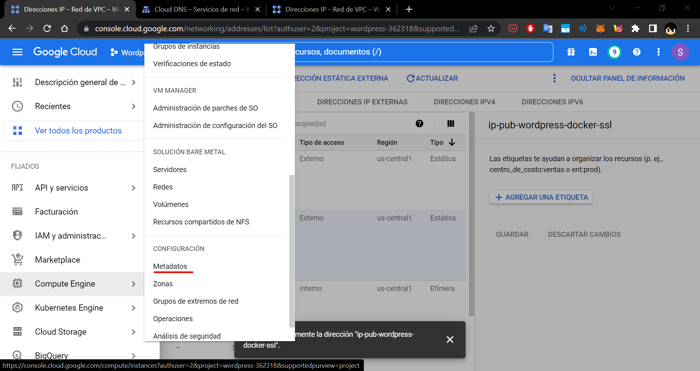
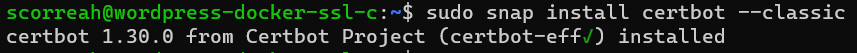
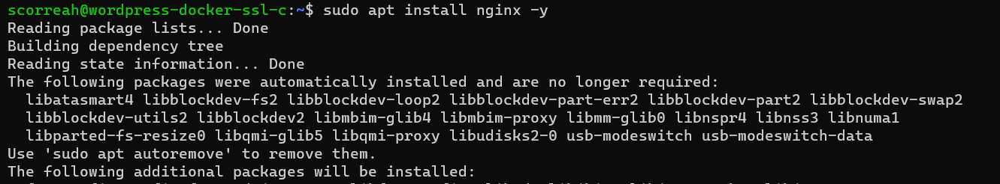
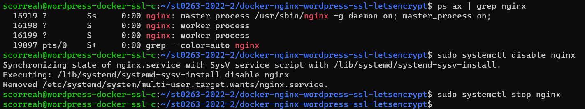
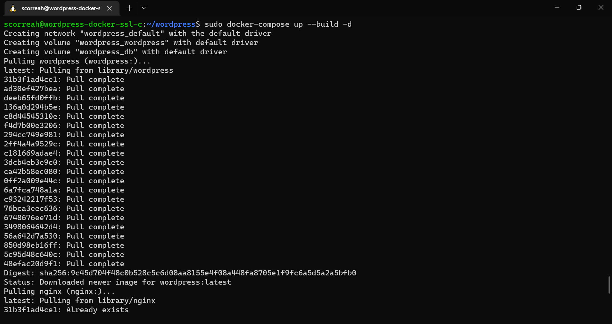

# **Lab03 - Docker Wordpress SSL**

### **Información general**
> Info de la materia: ST0263 Tópicos especiales en telemática

> Estudiante(s): 
> * Simón Correa Henao, scorreah@eafit.edu.co

> Profesor: Edwin Nelson Montoya, emontoya@eafit.edu.co

---  

## **1. Breve descripción de la actividad**

Se realizó el despliegue de un servidor de wordpress implementado mediante docker, y con la adición de un certificado valido de ssl expedido por letsencrypt. Todo en una maquina virtual alojada en Google Cloud Platform, con un dominio gratuito de Freenom y un servidor DNS alojado también en Cloud DNS de GCP.
### **1.1. Que aspectos cumplió o desarrolló de la actividad propuesta por el profesor (requerimientos funcionales y no funcionales)**

* El servidor con Wordpress debe estar desplegado en una maquina virtual en Google Cloud Platform (GCP), con IP Elástica en el puerto 443.
* El servidor debe contar con un certificado SSL valido, es decir funcionar con el protocolo https
* El certificado SSL debe ser emitido por la CA Letsencrypt, por medio de la herramienta Certbot.
* La maquina debe instanciar Wordpress desde Docker y Docker-Compose
* La dirección IP elastica debe contar con un dominio, expedido por el provedor de dominios Freenom
* El servidor DNS debe estar alojado en la nube, particularmente en la GCP
  
---  

## **2. Información general de diseño de alto nivel, arquitectura, patrones, mejores prácticas utilizadas**

- Se hace uso de una arquitectura Cliente-Servidor 
- El CMS desplegado es Wordpress con Contenedores
- Se hace el despliegue en GCP, con una t2.micro
- El servidor contiene Wordpress Dockerizado con Docker Compose, Php y MySQL
- La maquina virtual es una instancia de Ubuntu 20.04 LTS
- El servidor DNS está alojado dentro de los servicios de GCP
- El dominio se encuentra en el provedor de dominios Freenom
- El certificado SSL es expedido por Letsencrypt
  

    **Diseño de alto nivel:**  
      
  
---

## **3. Descripción del ambiente de desarrollo y técnico: lenguaje de programación, librerias, paquetes, etc, con sus numeros de versiones**
  
### **Detalles técnicos**  

*    **Tecnologías:**  
      
* **Sistema Operativo**: Ubuntu 20.04 LTS
* **CMS:** Wordpress 6.0.2
* **Base de Datos:** MySQL 
* **Lenguaje de programacion**: PHP 7.4.30
*  **Docker**: Docker version 20.10.12

## **Detalles del desarrollo**
### **Instancia en GCP con IP elastica y par de claves SSH**
   1. Dentro de Google Cloud Platform, en la sección Compute Engine --> Crear Instancia
        
   2. Creamos la instancia especificando el nombre de la maquina, tipo de maquina y la región (Dependiendo de esto cambiará el costo)
        
   3. Para este caso cambiamos el Sistema Operativo de la maquina para Ubuntu 20.04 LTS amd x86-64
        
        

   4. Ahora para obtener la IP elastica, nos dirigimos a Red VPC --> Direcciones IP --> Reservar Dirección Estatica Externa
        
        
   5. Le damos un nombre a la Dirección, para identificarla en GPC y lo adjuntamos
        
        
   6. Entonces quedará como a continuación:
        
   7. Ahora, para configurar las claves SSH, primero la generamos localmente:
        
   8. Luego en GPC damos click en Compute Engine --> Metadatos --> Editar --> Claves SSH. Y colocamos la clave publica generada previamente:
        
        
        
### **DNS en GPC y Dominio en Freenom**
   1. Nos dirigimos a Market Place y buscamos DNS Cloud
        
   2. Damos Click en Ir a Cloud DNS y luego en Habilitar:
        
        
   3. Ahora en Servicios de Red --> Cloud DNS damos click en Crear Zona
        
   4. En este punto creamos el archivo de zona:
        
        
        
   5. Luego agregamos los registros DNS:
        
        
        
        
   6. Con esto hecho nos dirigimos a Freenom y buscamos el dominio que queremos solicitar:
        
        
        
   7. Procedemos con los pasos requeridos:
        
        
        
   8. Ya habiendo reservado el dominio entramos a My Domains --> Manage Domain --> Nameservers
        
        
        
   9.  Y colocamos los servidores de GPC que aparecen en Cloud DNS en el registro NS que se creó al crear el archivo de zona:
        
        
### **Implementación**
   1. Nos conectamos a la maquina virtual, como explicado en [Como Conectarse al Servidor](#como-conectarse-al-servidor)
   2. Actualizamos los repositorios y paquetes
        
   3. Instalamos Certbot
        
   4. Instalamos letsencrypt
        
   5. Instalamos ngingx:
        
   6. Editamos la configuración de Nginx:
        
        
   7. Con la configuración de Nginx reconfigurada, creamos la carpeta correspondiente para letsencrypt y recargamos Nginx
        
   8. Ahora ejecutamos Letsencrypt para pedir el certificado SSL para registros especificos
        
   9. Entonces, ejecutamos certbot para pedir certificado SSL para todo el dominio (wildcard):Y al generarse el hash procedemos a crear un registro DNS en GPC como se indica en los pasos:
        
        
        
   10. Creamos las carpetas para wordpress y Docker Compose:
        
   11. Copiamos los archivos necesarios de letsecnrypt a nuestro wordpress y creamos el archivo options para Nginx:
        
        
   12. Creamos la llave requerida ss-dhparams.pem y la añadimos a Wordpress
        
   13. Realizamos las siguientes instrucciones para nuestro subdominio con NginX
        
        
   14. Instalamos Docker, Docker-Compose y Git:
        
   15. Habilitamos el servicio de Docker:
        
   16. Descargamos el repositorio de la materia y copiamos los archivos necesarios:
        
   17. Deshabilitamos NginX:
        
   18. Ejecutamos Docker-compose:
        
        
   19. Finalmente, ingresamos al dominio [https://www.scorreah.tk/](https://www.scorreah.tk/) y podremos verificar el certificado SSL y la conexión https:
        
   20. Configuramos Wordpress y listo, hemos terminado!
        

## **4. Descripción del ambiente de EJECUCIÓN (en producción) lenguaje de programación, librerias, paquetes, etc, con sus numeros de versiones**
* **Cloud:** Google Cloud Platform (GPC)
* **Proveedor de Dominios:** Freenom
* **Servidor DNS:** GPC
* **URL:** https://www.scorreah.tk/
* **Clave SSH**: Por correo al profesor
* **IP de la maquina**: 34.172.116.101

### **Como conectarse al servidor.**
El servidor de GPC se encuentra corriendo constantemente, así que solo se necesita acceder mediante SSH, de la siguiente forma:

1. Se pega la clave publica y privada en la carpeta .ssh del home del usuario: (Claves enviadas al profesor por interno)
2. Se corre el siguiente comando en el home de la persona:
   ```bash
   ssh -i ~/.ssh/google_compute_engine scorreah@34.172.116.101
   ```
    

 
### **Una mini guia de como un usuario utilizaría el software o la aplicación**
1. Ingresa desde el navegador a la pagina 

  
---

## **5. Otra información que considere relevante para esta actividad**

### **Referencias:**
- [Github st0263 Eafit - Docker Nginx Wordpress SSL Letsencrypt](https://github.com/st0263eafit/st0263-2022-2/tree/main/docker-nginx-wordpress-ssl-letsencrypt)

#### versión README.md -> 1.0 (2022-septiembre)