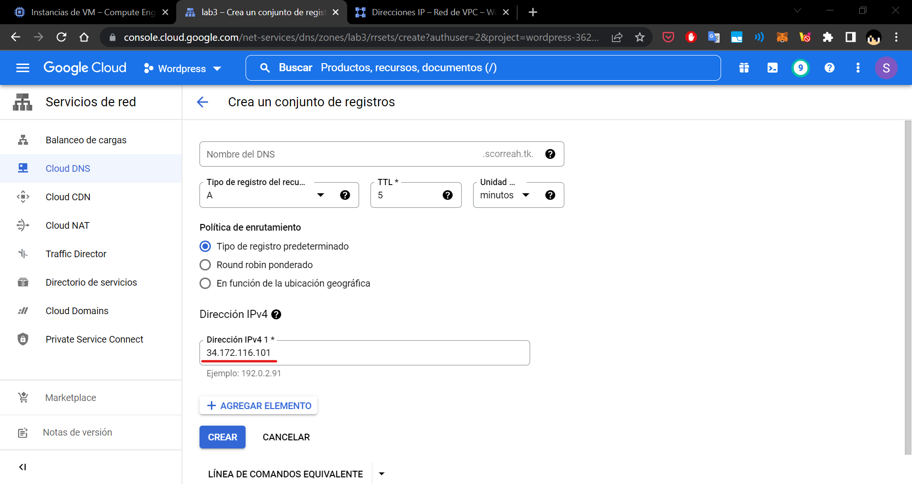
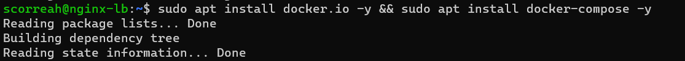
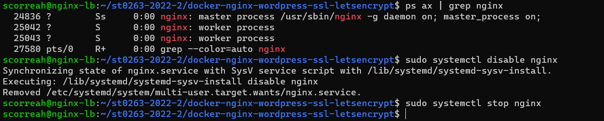
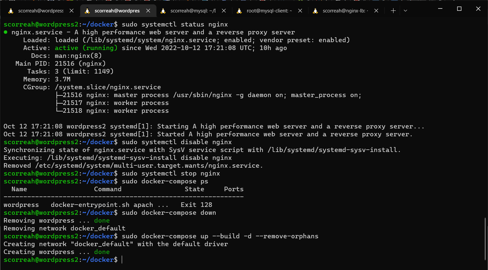

# **Lab03 - Docker Wordpress SSL Distributed**

### **Información general**
> Info de la materia: ST0263 Tópicos especiales en telemática

> Estudiante(s): 
> * Simón Correa Henao, scorreah@eafit.edu.co

> Profesor: Edwin Nelson Montoya, emontoya@eafit.edu.co

---  

## **1. Breve descripción de la actividad**

Se realizó el despligue de una aplicación monolitica del CMS de Wordpress en Docker con balanceo y alta disponibilidad. Se hizo uso de varias maquinas virtuales alojadas en Google CLoud Platform, con un dominio gratuito de Freenom y un servidor DNS alojado también en Cloud DNS de GCP. Además la aplicación cuenta con certificado SSL emitido por Letsencrypt.
### **1.1. Que aspectos cumplió o desarrolló de la actividad propuesta por el profesor (requerimientos funcionales y no funcionales)**

* La aplicación debe contar con un balanceador de carga implementado con Nginx
* El balanceador de carga debe contar con un certificado SSL valido, es decir funcionar con el protocolo https
* El certificado SSL debe ser emitido por la CA Letsencrypt, por medio de la herramienta Certbot.
* Los servidores con Wordpress deben estar desplegados en maquinas virtuales en Google Cloud Platform (GCP), con IP Elástica en el puerto 443.
* Los servidores con Wordpress deben tener acceso a una instancia de base de datos externa.
* La instancia de base de datos debe utilizar el gestor de bases de datos MySQL
* Los servidores con Wordpress deben tener acceso a una instancia de NFS por el cual se compartirán los archivos del servidor.
* Las maquinas deben instanciar Wordpress, Nginx y MySQL, respectivamente, desde Docker y Docker-Compose
* Todas las instancias deben contar con direcciones IP elasticas
* La dirección IP elastica del balanceador debe contar con un dominio, expedido por el provedor de dominios Freenom
* El servidor DNS debe estar alojado en la nube, particularmente en la GCP
  
---  

## **2. Información general de diseño de alto nivel, arquitectura, patrones, mejores prácticas utilizadas**

- Se hace uso de una arquitectura Cliente-Servidor 
- El CMS desplegado es Wordpress con Contenedores
- El balanceador hace uso de Nginx con Contenedores
- La base de datos hace uso de MySQL con Contenedores
- Se hace el despliegue en GCP, con e2.micro y e2.small
- Los servidores contienen Wordpress, MySQL y Nginx dockerizados con Docker Compose, respectivamente.
- Las maquinas virtuales son instancias de Ubuntu 20.04 LTS
- El servidor DNS está alojado dentro de los servicios de GCP
- El dominio se encuentra en el provedor de dominios Freenom
- El certificado SSL es expedido por Letsencrypt
  
     **Diseño de alto nivel:**  
       
  
---

## **3. Descripción del ambiente de desarrollo y técnico: lenguaje de programación, librerias, paquetes, etc, con sus numeros de versiones**
  
### **Detalles técnicos**  

*    **Tecnologías:**  
      
* **Sistema Operativo**: Ubuntu 20.04 LTS
* **CMS:** Wordpress 6.0.2
* **Base de Datos:** MySQL 
* **Lenguaje de programacion**: PHP 7.4.30
* **Docker**: Docker version 20.10.12
* **Nginx**: Nginx 1.23.1

## **Detalles del desarrollo**
### **Instancia en GCP con IP elastica y par de claves SSH**
   1. Dentro de Google Cloud Platform, en la sección Compute Engine --> Crear Instancia
        
   2. Creamos la instancia especificando el nombre de la maquina, tipo de maquina y la región (Dependiendo de esto cambiará el costo)
        
   3. Para este caso cambiamos el Sistema Operativo de la maquina para Ubuntu 20.04 LTS amd x86-64
        
        

   4. Ahora para obtener la IP elastica, nos dirigimos a Red VPC --> Direcciones IP --> Reservar Dirección Estatica Externa
        
        
   5. Le damos un nombre a la Dirección, para identificarla en GPC y lo adjuntamos
        
        
   6. Entonces quedará como a continuación:
        
   7. Ahora, para configurar las claves SSH, primero la generamos localmente:
        
   8. Luego en GPC damos click en Compute Engine --> Metadatos --> Editar --> Claves SSH. Y colocamos la clave publica generada previamente:
        
        
        
### **DNS en GPC y Dominio en Freenom**
   1. Nos dirigimos a Market Place y buscamos DNS Cloud
        
   2. Damos Click en Ir a Cloud DNS y luego en Habilitar:
        
        
   3. Ahora en Servicios de Red --> Cloud DNS damos click en Crear Zona
        
   4. En este punto creamos el archivo de zona:
        
        
        
   5. Luego agregamos los registros DNS:
        
        
        
        
   6. Con esto hecho nos dirigimos a Freenom y buscamos el dominio que queremos solicitar:
        
        
        
   7. Procedemos con los pasos requeridos:
        
        
        
   8. Ya habiendo reservado el dominio entramos a My Domains --> Manage Domain --> Nameservers
        
        
        
   9.  Y colocamos los servidores de GPC que aparecen en Cloud DNS en el registro NS que se creó al crear el archivo de zona:
        
        
### **Implementación**
En todas las maquinas vamos a seguir los siguientes pasos
   1. Nos conectamos a la maquina virtual, como explicado en [Como Conectarse al Servidor](#como-conectarse-al-servidor)
   2. Actualizamos los repositorios y paquetes
        
### **NFS**
   3. Instalamos NFS
        
   4. Creamos el directorio que vamos a compartir y establecemos los permisos adecuados
        
   5. Establecemos la configuración del NFS, teniendo en cuenta la red privada que estamos utilizando en GCP
        
        
   6. Actualizamos las reglas de firewall para permitir el protocolo de nfs
        
   7. Nos dirigimos a la maquina wordpress y actualizamos sus paquetes y repositorios
        
   8. Instalamos nfs en cada instancia de wordpress
        
   9. Editamos la configuración de NFS en cada wordpress, e indicamos la carpeta a compartir
        
   10. Instalamos Nginx en cada instancia de wordpress
        
   11. Montamos la carpeta compartida en cada wordpress
        
   12. Verificamos que se compartan los archivos entre las instancias creando un archivo y confirmando que se sincronice en las otras maquinas
        
### **Database**
   3. Instalamos Docker y Docker-Compose
        
        
   4. Lanzamos el servicio de Docker
        
   5. Editamos y lanzamos el docker-compose.yaml
        
        
   6. Creamos los usuarios en MySQL
        
   7. Actualizamos las reglas del firewall
        

### **Load Balancer**
   3. Instalamos Certbot
        
   4. Instalamos letsencrypt
        
   5. Instalamos ngingx:
        
   6. Editamos la configuración de Nginx:
        
        
   7. Con la configuración de Nginx reconfigurada, creamos la carpeta correspondiente para letsencrypt y recargamos Nginx
        
   8. Ahora ejecutamos Letsencrypt para pedir el certificado SSL para registros especificos
        
   9. Entonces, ejecutamos certbot para pedir certificado SSL para todo el dominio (wildcard):Y al generarse el hash procedemos a crear un registro DNS en GPC como se indica en los pasos:
        
        
        
   10. Creamos la carpeta para los archivos de Nginx y SSL:
        
   11. Copiamos los archivos necesarios de letsencrypt a nuestro wordpress y creamos el archivo options para Nginx:
        
        
   12. Creamos la llave requerida ss-dhparams.pem y la añadimos a Wordpress
        
   13. Realizamos las siguientes instrucciones para nuestro subdominio con NginX
        
   14. Instalamos Docker, Docker-Compose:
        
   15. Descargamos el repositorio de la materia y copiamos los archivos necesarios:
        
   16. Habilitamos el servicio de Docker:
        
   17. Deshabilitamos NginX:
        
   18. Editamos el archivo de configuración de docker-compose
        
   19. Editamos el archivo de configuración de Nginx
        
        
   20. Ejecutamos Docker-compose:
        
        
### **Wordpress**
   3. Instalamos Docker y Docker-Compose:
        
   4. Creamos el archivo docker-compose.yaml:
        
   5. Ejecutamos Docker-Compose up, teniendo en cuenta la configuración de la base de datos:
        
        
   6.  Configuramos Wordpress y listo, hemos terminado!
        
   7.  Finalmente, ingresamos al dominio [https://lab4.scorreah.tk/](https://lab4.scorreah.tk/) y podremos verificar el certificado SSL y la conexión https:
        


## **4. Descripción del ambiente de EJECUCIÓN (en producción) lenguaje de programación, librerias, paquetes, etc, con sus numeros de versiones**
* **Cloud:** Google Cloud Platform (GPC)
* **Proveedor de Dominios:** Freenom
* **Servidor DNS:** GPC
* **URL:** https://lab4.scorreah.tk/
* **Clave SSH**: Por correo al profesor
* **IP de la maquina (LB)**: 34.172.116.101
* **IPs**: 

### **Como conectarse al servidor.**
El servidor de GPC se encuentra corriendo constantemente, así que solo se necesita acceder mediante SSH, de la siguiente forma:

1. Se pega la clave publica y privada en la carpeta .ssh del home del usuario: (Claves enviadas al profesor por interno)
2. Se corre el siguiente comando en el home de la persona:
   ```bash
   eval $(ssh-agent -s)
   ssh-add ~/.ssh/gcp
   ssh scorreah@direccionIP
   ```
    

 
### **Una mini guia de como un usuario utilizaría el software o la aplicación**
1. Ingresa desde el navegador a la pagina [https://lab4.scorreah.tk/](https://lab4.scorreah.tk/)

  
---

## **5. Otra información que considere relevante para esta actividad**

### **Referencias:**
- [Github st0263 Eafit - Docker Nginx Wordpress SSL Letsencrypt](https://github.com/st0263eafit/st0263-2022-2/tree/main/docker-nginx-wordpress-ssl-letsencrypt)

#### versión README.md -> 1.0 (2022-octubre)