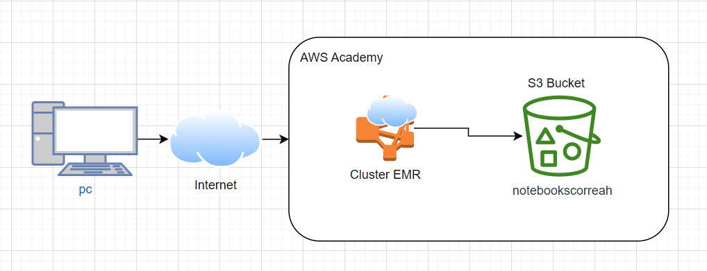

# **Lab05 (Parte 1) - EMR Cluster Creation and First Steps**

### **Información general**
> Info de la materia: ST0263 Tópicos especiales en telemática

> Estudiante(s): 
> * Simón Correa Henao, scorreah@eafit.edu.co

> Profesor: Edwin Nelson Montoya, emontoya@eafit.edu.co

---  

## **1. Breve descripción de la actividad**

Se realizó la creación, despliegue, finalización y clonación de un Cluster de AWS con EMR. Se realizaron los primeros pasos con el cluster y se probaron las funcionalidades de hadoop, jupyter, hue y zeppelin. Se hizo también uso de S3 para almacenar parte de la información del cluster, a su vez que se vinculó con este.
### **1.1. Que aspectos cumplió o desarrolló de la actividad propuesta por el profesor (requerimientos funcionales y no funcionales)**

* El servidor DNS debe estar alojado en la nube, particularmente en la GCP
* El cluster se creó en AWS EMR
* El cluster se instanció con una clave nueva .pem
* El cluster contó con persistencia instanciada en el servicio de bucker S3
* El cluster se instanció con maquinas m4.xlarge con 20GB de volumen para los nodos
* El cluster se realizó en la versión 6.3.1 de Amazon
  
---  

## **2. Información general de diseño de alto nivel, arquitectura, patrones, mejores prácticas utilizadas**

- El cluster hace uso del modelo master-slave
- El cluster se despliega en AWS con EMR y Buckets S3
  
     **Diseño de alto nivel:**  
       
  
---

## **3. Descripción del ambiente de desarrollo y técnico: lenguaje de programación, librerias, paquetes, etc, con sus numeros de versiones**
  
### **Detalles técnicos**  

*  **Servicios:** Hadoop, Hue, Jupyter, Zeppelin
* **Cluster** AWS EMR 6.3.1
* **Bucket:** AWS S3

## **Detalles del desarrollo**
### **Generación de par de claves SSH**
   1. Dentro de AWS EC2, en la sección Instancias, ingresamos a crear instancia. Y en sección de par de claves, creamos un nuevo par de claves:
        
   2. Luego cancelamos la creación de la instancia una vez se hayan creado el par de claves
### **Creación de cluster y primeros pasos**
   1. Ingresamos a AWS EMR, y damos click en *Crear cluster*
        
   2. Especificamos la configuración de Software, como a continuación, asegurandonos de ponerle un nombre al bucket S3 que vamos a utilizar (En este caso notebookscorreah):
        
   3. Continuando con las opciones, configuramos las instancias a usar como m4.xlarge y spot:
        
   4. Establecemos el tamaño del volumen EBS y desactivamos el autoscaling:
        
   5. En el Step 3 de AWS para la configuración general del Cluster, lo dejamos así:
        
   6. En el Step 4 de Seguridad, especificamos el par de claves creado previamente, y damos click en *Crear cluster* (Puede tardar 30-40 minutos):
        
   7. Ahora, para crear el Bucket S3, ingresamos a Amazon S3, y damos click en *Crear Bucket*:
        
   8. Especificamos el nombre del bucket y donde estará alojado:
        
   9. Una vez creado el Bucket, aparecerá un mensaje como el siguiente:
        
   10. Luego, volviendo a EMR, ingresamos al cluster recien creado y damos click en *Connext to the Master Node Using SSH*, para copiar el comando y pegarlo nuestra terminal (Recordar [Como Conectarse a las maquinas](#como-conectarse-a-las-maquinas)):
        
        
   11. Si el paso anterior no funciona, debemos estar seguros que nuestro cluster se encuentre corriendo, y ya haya cargado:
        
   12. Una vez cargado, nos dirigimos al cluster, y en Aplicaciones, vamos a probar las siguientes:
        
   13. Antes, que nada, debemos habilitar los puertos necesarios para estas apps, así como el puerto para SSH:
        
   14. Y editamos también las reglas del grupo de seguridad del cluster:
        
        
        
        
        
   15. En este punto, ya podemos probar la primera App del paso 12, Hue (Tonalidad), creando un usuario al ingresar:
        
   16. Confirmamos que funciona la base de datos, y también HDFS:
        
        
        Cabe aclarar que S3 si es persistente, a diferencia de lo almacenado en HDFS.
   17. Probamos Jupyter con spark:
        
        
        
   18. Probamos Zeppelin:
        
        
        
   19. Para terminar el Cluster correctamente, los seleccionamos y damos en *Finalizar*:
        
        
   20. En el caso de necesitar hacer un cluster rapidamente, con todos los pasos anteriores ya hechos, excepto los usuarios y archivos de HDFS, clonamos el cluster:
        
        


## **4. Descripción del ambiente de EJECUCIÓN (en producción) lenguaje de programación, librerias, paquetes, etc, con sus numeros de versiones**
* **Cloud:** Amazon Web Services (AWS)
* **Cluster** AWS EMR 6.3.1
* **Bucket:** AWS S3
* **Clave SSH**: Por correo al profesor

### **Como conectarse a las maquinas.**
Las maquinas de AWS solo corren durante un periodo de 4 horas, por lo que se debe informar previamente ponerlas a en funcionamiento.
Para acceder una maquina del cluster se hace de la siguiente manera:

1. Se pega la llave .pem en la carpeta .ssh del home del usuario: (Claves enviadas al profesor por interno)
2. Se corre el comando correspondiente a la maquina a la cual se quiere conectar, en el home de la persona, como a continuación:
   ```bash
   eval $(ssh-agent -s)
   ssh-add ~/.ssh/gcp
   ssh scorreah@direccionIP

   ```
    

---

## **5. Otra información que considere relevante para esta actividad**

### **Referencias:**
- [Github st0263 Eafit - Bigdata lab5-1](https://github.com/st0263eafit/st0263-2022-2/blob/main/bigdata/lab5-1-aws-emr.txt)

#### versión README.md -> 1.0 (2022-octubre)