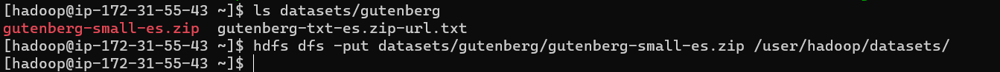
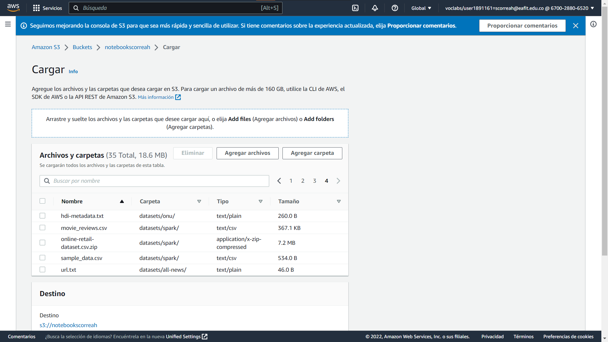
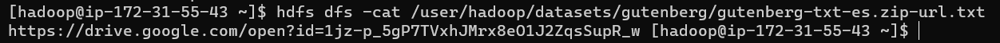

# **Lab05 (Parte 2) - EMR HDFS Managing files and data**

### **Información general**
> Info de la materia: ST0263 Tópicos especiales en telemática

> Estudiante(s): 
> * Simón Correa Henao, scorreah@eafit.edu.co

> Profesor: Edwin Nelson Montoya, emontoya@eafit.edu.co

---  

## **1. Breve descripción de la actividad**

Se realizó la creación, despliegue, finalización y clonación de un Cluster de AWS con EMR. Se realizaron los primeros pasos con el cluster y se probaron las funcionalidades de hadoop, jupyter, hue y zeppelin. Se hizo también uso de S3 para almacenar parte de la información del cluster, a su vez que se vinculó con este.
Luego se hicieron operaciones con hdfs.

### **1.1. Que aspectos cumplió o desarrolló de la actividad propuesta por el profesor (requerimientos funcionales y no funcionales)**

* El cluster se creó en AWS EMR
* El cluster se instanció con una clave nueva .pem
* El cluster contó con persistencia instanciada en el servicio de bucker S3
* El cluster se instanció con maquinas m4.xlarge con 20GB de volumen para los nodos
* El cluster se realizó en la versión 6.3.1 de Amazon
* El cluster contó con los servicios de Hue, Hadoop, Spark, Jupiter y Zeppelin
* Los archivos de HDFS se gestionaron tanto por terminal via HDFS, como via Hue en Amazon EMR
  
---  

## **2. Información general de diseño de alto nivel, arquitectura, patrones, mejores prácticas utilizadas**

- El cluster hace uso del modelo master-slave
- El cluster se despliega en AWS con EMR y Buckets S3
  
     **Diseño de alto nivel:**  
       
  
---

## **3. Descripción del ambiente de desarrollo y técnico: lenguaje de programación, librerias, paquetes, etc, con sus numeros de versiones**
  
### **Detalles técnicos**  

*  **Servicios:** Hadoop, Hue, Jupyter, Zeppelin
* **Cluster** AWS EMR 6.3.1
* **Bucket:** AWS S3

## **Detalles del desarrollo**
### **Generación de par de claves SSH**
   1. Dentro de AWS EC2, en la sección Instancias, ingresamos a crear instancia. Y en sección de par de claves, creamos un nuevo par de claves:
        
   2. Luego cancelamos la creación de la instancia una vez se hayan creado el par de claves
### **Creación de cluster y primeros pasos**
   1. Ingresamos a AWS EMR, y damos click en *Crear cluster*
        
   2. Especificamos la configuración de Software, como a continuación, asegurandonos de ponerle un nombre al bucket S3 que vamos a utilizar (En este caso notebookscorreah):
        
   3. Continuando con las opciones, configuramos las instancias a usar como m4.xlarge y spot:
        
   4. Establecemos el tamaño del volumen EBS y desactivamos el autoscaling:
        
   5. En el Step 3 de AWS para la configuración general del Cluster, lo dejamos así:
        
   7. En el Step 4 de Seguridad, especificamos el par de claves creado previamente, y damos click en *Crear cluster* (Puede tardar 30-40 minutos):
        
   8. Ahora, para crear el Bucket S3, ingresamos a Amazon S3, y damos click en *Crear Bucket*:
        
   9. Especificamos el nombre del bucket y donde estará alojado:
        
   10. Una vez creado el Bucket, aparecerá un mensaje como el siguiente:
        
   11. Luego, volviendo a EMR, ingresamos al cluster recien creado y damos click en *Connext to the Master Node Using SSH*, para copiar el comando y pegarlo nuestra terminal (Recordar [Como Conectarse a las maquinas](#como-conectarse-a-las-maquinas)):
        
        
   12. Si el paso anterior no funciona, debemos estar seguros que nuestro cluster se encuentre corriendo, y ya haya cargado:
        
   14. Una vez cargado, nos dirigimos al cluster, y en Aplicaciones, vamos a probar las siguientes:
        
   15. Antes, que nada, debemos habilitar los puertos necesarios para estas apps, así como el puerto para SSH:
        
   16. Y editamos también las reglas del grupo de seguridad del cluster:
        
        
        
        
        
   18. En este punto, ya podemos probar la primera App del paso 12, Hue (Tonalidad), creando un usuario al ingresar:
        
   19. Confirmamos que funciona la base de datos, y también HDFS:
        
        
        Cabe aclarar que S3 si es persistente, a diferencia de lo almacenado en HDFS.
   21. Probamos Jupyter con spark:
        
        
        
   22. Probamos Zeppelin:
        
        
        
   23. Para terminar el Cluster correctamente, los seleccionamos y damos en *Finalizar*:
        
        
   24. En el caso de necesitar hacer un cluster rapidamente, con todos los pasos anteriores ya hechos, excepto los usuarios y archivos de HDFS, clonamos el cluster:
        
        

### **Gestion de archivos en HDFS**
   **1. Via Terminal**  
   1.  En el cluster > Historial de aplicaciones, copiamos la dirección de Hue (Tonalidad):
        
   2.  [Ingresamos al cluster](#como-conectarse-a-las-maquinas) y listamos los archivos:
          ```bash
          hdfs dfs -ls /
          hdfs dfs -ls /user
          hdfs dfs -ls /user/hadoop
          ``` 
        
        
   3.  Para crear carpetas dentro de hdfs:
          ```bash
          hdfs dfs -mkdir /user/hadoop/datasets
          hdfs dfs -mkdir /user/hadoop/datasets/gutenberg-small
          ``` 
        
        
   4.  Descargamos la carpeta [datasets](datasets/) y procedemos a copiarla al cluster, via scp, desde nuestra maquina local:
          ```bash
           scp -i ~/Lab5.pem -r datasets/ hadoop@ec2-100-26-224-103.compute-1.amazonaws.com:/home/hadoop/
          ``` 
        
        
   5.  Cargamos los datos desde el master del cluster hacía el HDFS:
          ```bash
           ls datasets/gutenberg
           hdfs dfs -put datasets/gutenberg/gutenberg-small-es.zip /user/hadoop/datasets/
          ``` 
        
   6.  Ingresamos a Hue y confirmamos que los datos están ahí:
        
   7.  Para cargar los datos a S3:
        
        
        
   8.  Para cargar los datos desde S3 a HDFS y Hue:
          ```bash
           hadoop distcp s3://notebookscorreah/datasets/airlines.csv /tmp/
           ls /tmp/
          ``` 
        
        
   9.  Otra alternativa para copiar los datos desde el master:
          ```bash
           hdfs dfs -copyFromLocal datasets/* /user/hadoop/datasets/
           hdfs dfs -ls /user/hadoop/datasets
          ``` 
        
   10. Para copiar los datos desde HDFS al master:
          ```bash
           mkdir mis_datasets
           hdfs dfs -ls /user/hadoop/datasets/gutenberg
           hdfs dfs -copyToLocal /user/hadoop/datasets/gutenberg/gutenberg-small-es.zip ~/mis_datasets/ls mis_datasets/
          ``` 
        
        
   11. Otra alternativa para copiar los datos a local:
          ```bash
           hdfs dfs -get /user/hadoop/datasets/gutenberg-small/* ~/mis_datasets/
           ls mis_datasets/
          ``` 
        
   12. Programa du en hdfs:
          ```bash
           hdfs dfs -du /user/hadoop/
          ``` 
        
   13. Programa mv en hdfs:
          ```bash
           hdfs dfs -mv /user/hadoop/datasets/airlines.csv /user/hadoop/
           hdfs dfs -ls /user/hadoop/
          ``` 
        
   14. Programa cp en hdfs:
          ```bash
           hdfs dfs -cp /user/hadoop/airlines.csv /user/hadoop/datasets/
           hdfs dfs -ls /user/hadoop/datasets
          ``` 
        
   15. Programa rm en hdfs:
          ```bash
           hdfs dfs -rm /user/hadoop/airlines.csv
          ``` 
        
   16. Programa cat en hdfs:
          ```bash
           hdfs dfs -cat /user/hadoop/datasets/gutenberg/gutenberg-txt-es.zip-url.txt
          ``` 
        
   17. Programa chmod en hdfs:
          ```bash
           hdfs dfs -chmod /user/hadoop/datasets/gutenberg/gutenberg-txt-es.zip-url.txt
           hdfs dfs -ls /user/hadoop/datasets/gutenberg/gutenberg-txt-es.zip-url.txt
          ``` 
        
     **2. Via Hue**
   18. Manejo de carpetas desde Hue:
        
        
        
   19. Carga de archivos Hue:
        
        
        


## **4. Descripción del ambiente de EJECUCIÓN (en producción) lenguaje de programación, librerias, paquetes, etc, con sus numeros de versiones**
* **Cloud:** Amazon Web Services (AWS)
* **Cluster** AWS EMR 6.3.1
* **Bucket:** AWS S3
* **Clave SSH**: Por correo al profesor

### **Como conectarse a las maquinas.**
Las maquinas de AWS solo corren durante un periodo de 4 horas, por lo que se debe informar previamente ponerlas a en funcionamiento.
Para acceder una maquina del cluster se hace de la siguiente manera:

1. Se pega la llave .pem en la carpeta .ssh del home del usuario: (Claves enviadas al profesor por interno)
2. Se corre el comando correspondiente a la maquina a la cual se quiere conectar, en el home de la persona, como a continuación:
   ```bash
   ssh -i ~/.ssh/Lab5.pem hadoop@ec2.compute-1.amazonaws.com
   ```
    

---

## **5. Otra información que considere relevante para esta actividad**

### **Referencias:**
- [Github st0263 Eafit - Bigdata lab5-1](https://github.com/st0263eafit/st0263-2022-2/blob/main/bigdata/lab5-1-aws-emr.txt)
- [Github st0263 Eafit - Bigdata lab5-2](https://github.com/st0263eafit/st0263-2022-2/tree/main/bigdata/01-hdfs)

#### versión README.md -> 1.0 (2022-octubre)