# **Lab06 - Wordcount en Apache Spark EN AWS EMR 6.3.1**

### **Información general**
> Info de la materia: ST0263 Tópicos especiales en telemática

> Estudiante(s): 
> * Simón Correa Henao, scorreah@eafit.edu.co

> Profesor: Edwin Nelson Montoya, emontoya@eafit.edu.co

---  

## **1. Breve descripción de la actividad**

Se realizó la clonación de un Cluster de AWS con EMR, el cual se utilizó para ejecutar el programa wordcount por medio de 'pyspark' con datos en HDFS y S3; así como se ejecutó el wordcount desde JupiterHub con datos en S3.

También se realizaron ejercicios de data processing usando PySpark desde Jupiter.

### **1.1. Que aspectos cumplió o desarrolló de la actividad propuesta por el profesor (requerimientos funcionales y no funcionales)**

* El cluster se creó en AWS EMR
* El cluster se instanció con una clave nueva .pem
* El cluster contó con persistencia instanciada en el servicio de bucker S3
* El cluster se instanció con maquinas m4.xlarge con 20GB de volumen para los nodos
* El cluster se realizó en la versión 6.3.1 de Amazon
* El cluster contó con los servicios de Hue, Hadoop, Spark, Jupiter y Zeppelin
* El wordcount se ejecutó en PySpark con datos de HDFS y S3
* El wordcount se ejecutó en JupiterHub con PySpark y datos de S3
  
---  

## **2. Información general de diseño de alto nivel, arquitectura, patrones, mejores prácticas utilizadas**

- El cluster hace uso del modelo master-slave
- El cluster se despliega en AWS con EMR y Buckets S3
  
     **Diseño de alto nivel:**  
     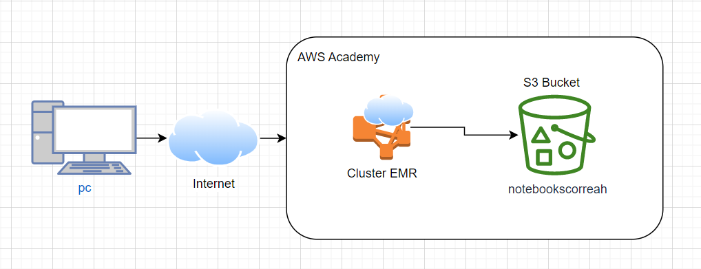  
  
---

## **3. Descripción del ambiente de desarrollo y técnico: lenguaje de programación, librerias, paquetes, etc, con sus numeros de versiones**
  
### **Detalles técnicos**  

* **Servicios:** Hadoop, Hue, Jupyter, Zeppelin
* **Dataframe:** PySpark
* **Cluster** AWS EMR 6.3.1
* **Bucket:** AWS S3

## **Detalles del desarrollo**
### **Generación de par de claves SSH**
   1. Dentro de AWS EC2, en la sección Instancias, ingresamos a crear instancia. Y en sección de par de claves, creamos un nuevo par de claves:
        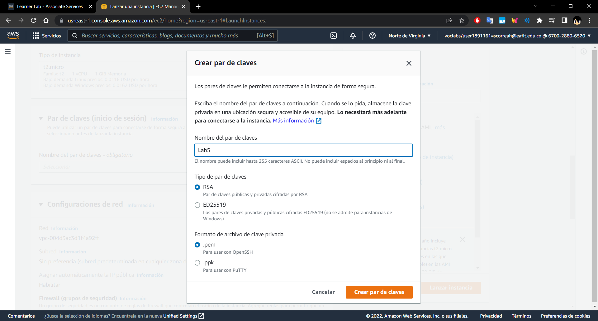
   2. Luego cancelamos la creación de la instancia una vez se hayan creado y descargado el par de claves
### **Clonación de cluster y primeros pasos**
   1. Habiendo seguido los pasos de [Lab 5](../Lab%205/README.md), se procedió a clonar el cluster
   2.  Para clonar el cluster con todos los pasos anteriores ya hechos, excepto los usuarios y archivos de HDFS, clonamos el cluster:
        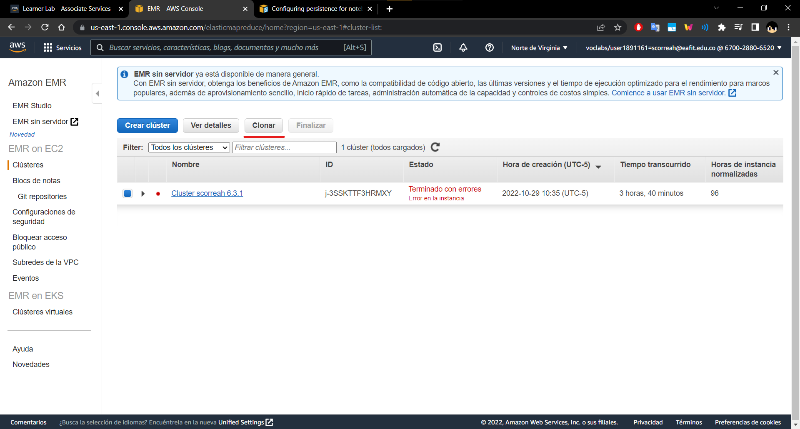
        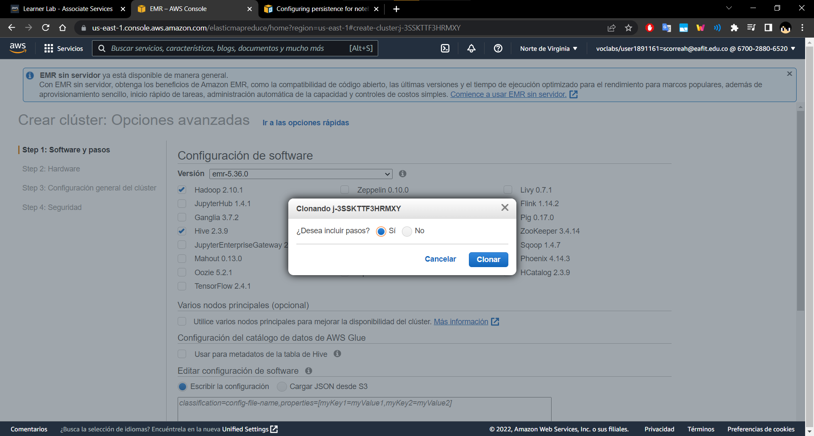
   3.  Luego, volviendo a EMR, ingresamos al cluster recien creado y damos click en *Connext to the Master Node Using SSH*, para copiar el comando y pegarlo nuestra terminal (Recordar [Como Conectarse a las maquinas](#como-conectarse-a-las-maquinas)):
        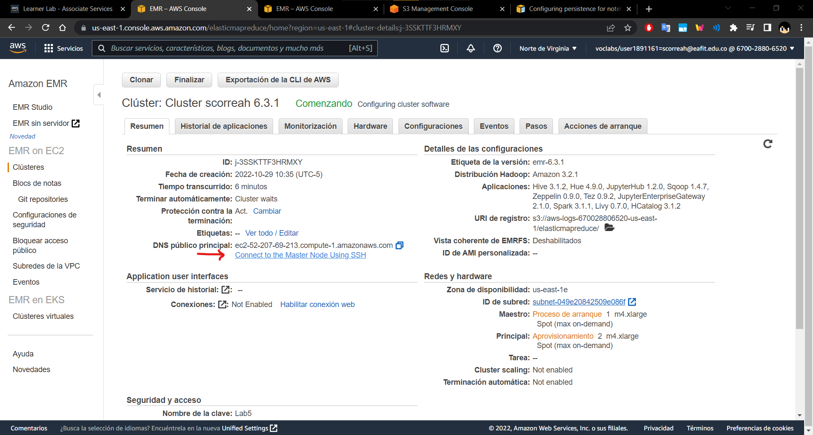
        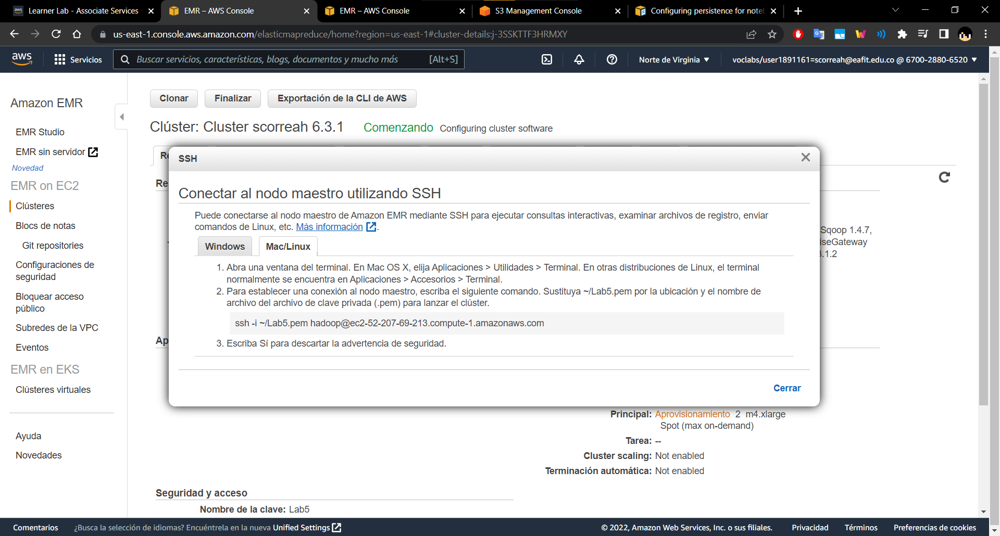
   4.  Si el paso anterior no funciona, debemos estar seguros que nuestro cluster se encuentre corriendo, y ya haya cargado:
        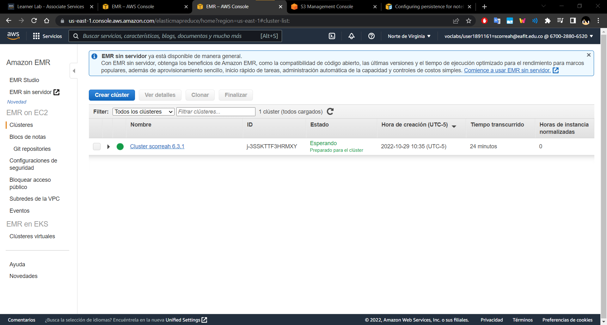
   5.  Para terminar el Cluster correctamente, los seleccionamos y damos en *Finalizar*:
> Esta paso solo debemos realizarlo una vez terminado todo el laboratorio, y antes de haber pasado 4 horas desde creado el cluster

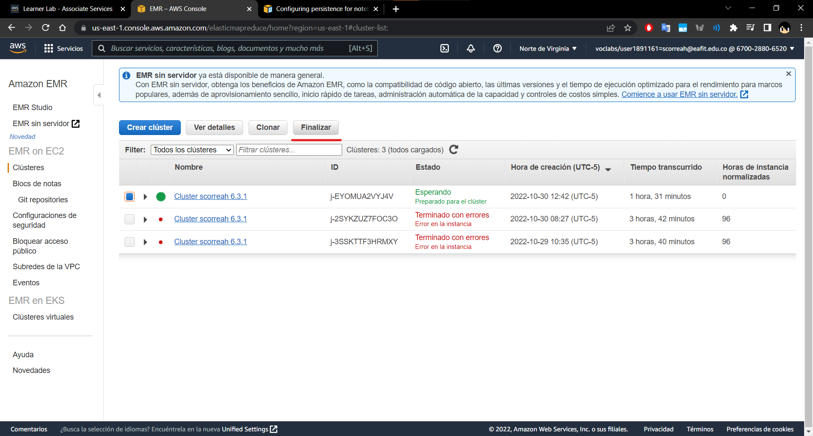
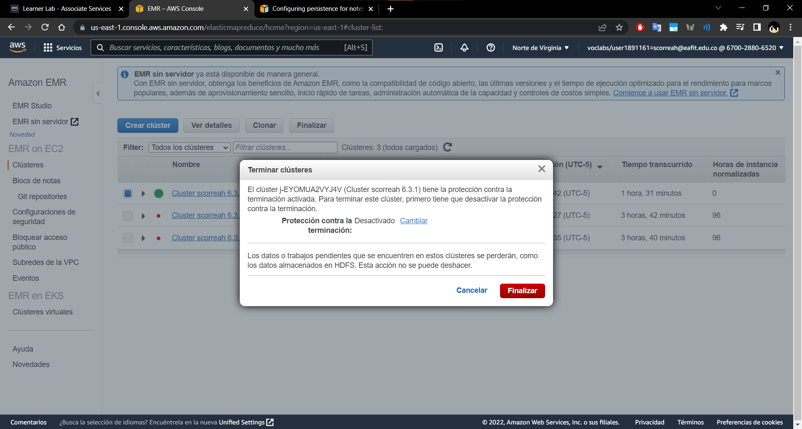

### **Carga de datasets en HDFS y S3**
   1.  En el cluster > Historial de aplicaciones, copiamos la dirección de Hue (Tonalidad):
        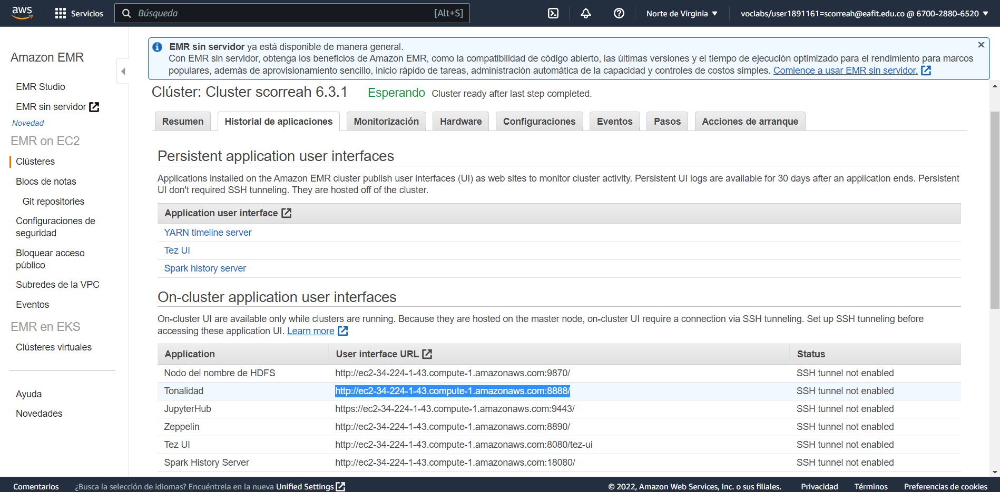
   2.  [Ingresamos al cluster](#como-conectarse-a-las-maquinas) y listamos los archivos:
          ```bash
          hdfs dfs -ls /
          hdfs dfs -ls /user
          hdfs dfs -ls /user/hadoop
          ``` 
        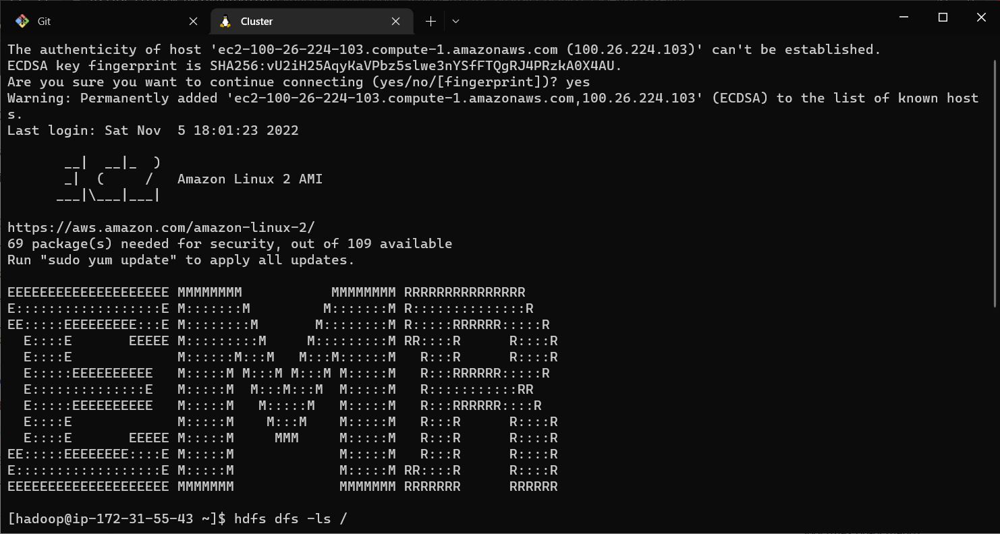
        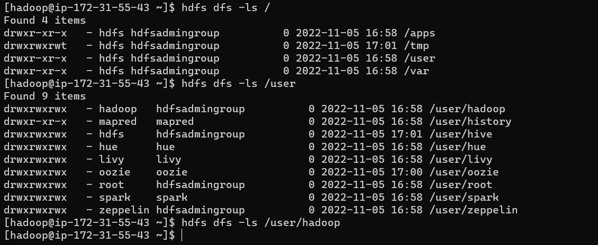
   3.  Para crear carpetas dentro de hdfs:
          ```bash
          hdfs dfs -mkdir /user/hadoop/datasets
          ``` 
        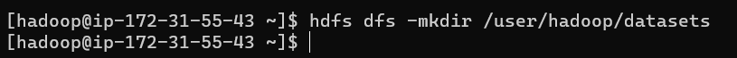
   4.  Descargamos la carpeta [datasets](datasets/) y procedemos a copiarla al cluster, via scp, desde nuestra maquina local:
          ```bash
           scp -i ~/Lab5.pem -r datasets/ hadoop@ec2-100-26-224-103.compute-1.amazonaws.com:/home/hadoop/
          ``` 
        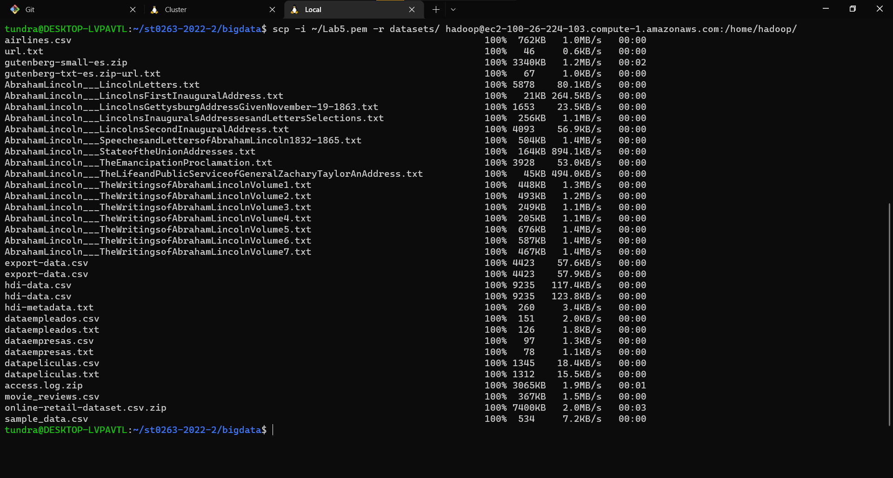
        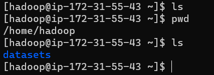
   5.  Cargamos los datos desde el master del cluster hacía el HDFS:
          ```bash
           hdfs dfs -copyFromLocal datasets/* /user/hadoop/datasets/
           hdfs dfs -ls /user/hadoop/datasets
          ``` 
        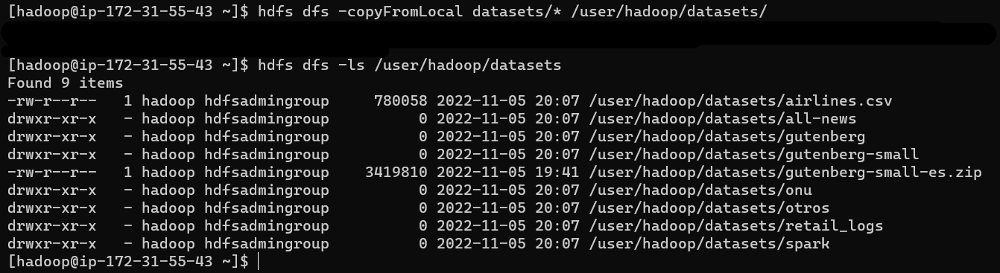
   6.  Ingresamos a Hue y confirmamos que los datos están ahí:
        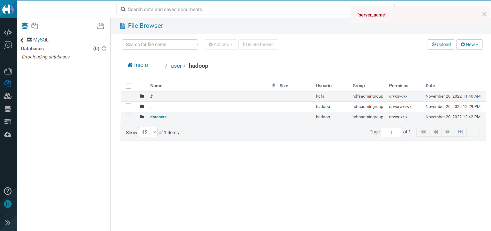
   7.  Para cargar los datos a S3:
        
        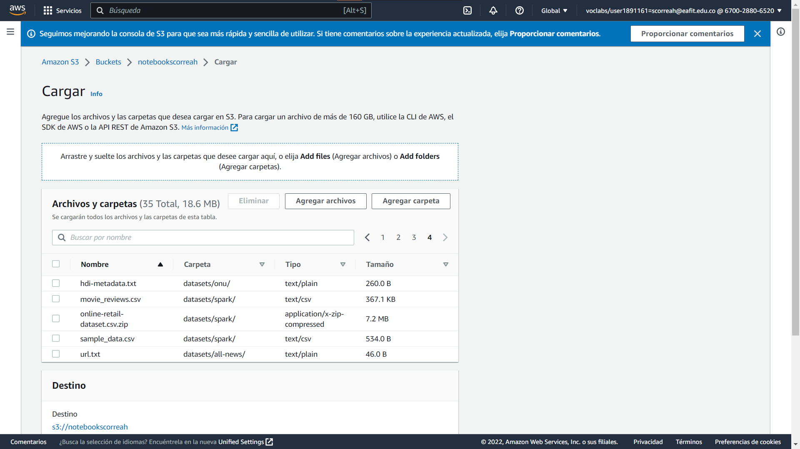
        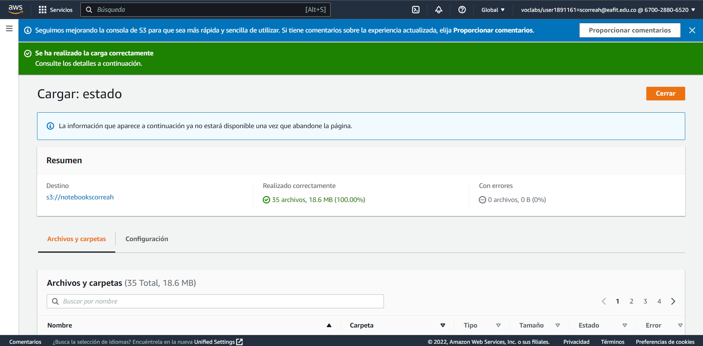

## **Parte 1**
### **Ejecutar el wordcount por linea de comando 'pyspark' Interactivo en EMR con datos en HDFS vía ssh en el nodo master.**
   1.  Ingresamos al master y ejecutamos el wordcount con pyspark:
          ```bash
          $ pyspark
          >>> files_rdd = sc.textFile("hdfs:///user/hadoop/datasets/gutenberg-small/*.txt")
          >>> wc_unsort = files_rdd.flatMap(lambda line: line.split()).map(lambda word: (word, 1)).reduceByKey(lambda a, b: a + b)
          >>> wc = wc_unsort.sortBy(lambda a: -a[1])
          >>> for tupla in wc.take(10):
          >>>     print(tupla)
          >>> wc.saveAsTextFile("hdfs:///tmp/wcout1")
          ```
        
   2.  Vemos los resultados en Hue
        

### **Ejecutar el wordcount por linea de comando 'pyspark' Interactivo en EMR con datos en S3 vía ssh en el nodo master.**
   1.  Revisamos el notebook de S3 y que se tengan cargados los datasets, comenzamos:
        
   2.  Ingresamos al master y ejecutamos el wordcount con pyspark:
          ```bash
          $ pyspark
          >>> files_rdd = sc.textFile("s3://notebookscorreah/datasets/gutenberg-small/*.txt")
          >>> wc_unsort = files_rdd.flatMap(lambda line: line.split()).map(lambda word: (word, 1)).reduceByKey(lambda a, b: a + b)
          >>> wc = wc_unsort.sortBy(lambda a: -a[1])
          >>> for tupla in wc.take(10):
          >>>     print(tupla)
          >>> wc.saveAsTextFile("hdfs:///tmp/wcout2")
          ```
        
   3.  Vemos los resultados en Hue:
        

### **Ejecutar el wordcount en JupyterHub Notebooks EMR con datos en S3 (tanto datos de entrada como de salida) usando un clúster EMR.**
   1.  Ingresamos a Jupyter y cargamos el archivo [wordcount-spark.ipynb](wordcount-spark.ipynb) para ejecutar con pyspark:
        
        
        
   2.  Revisamos el notebook de S3 y que se tengan cargados los datasets, y comenzamos:
        
   3.  Abrimos el archivo, y modificamos el tipo a PySpark:
        
   4.  Ejecutamos el notebook completo y verificamos los resultados en S3:
        
        
   5.  Vemos los resultados en Hue:
        

## **Parte 2**
### **Replique, ejecute y ENTIENDA el notebook: Data_processing_using_PySpark.ipynb con los datos respectivos.**
   1.  Ingresamos a Jupyter y cargamos el archivo [Data_processing_using_PySpark.ipynb](Data_processing_using_PySpark.ipynb) para ejecutar con pyspark:
        
   2.  Cambiamos la version de Python e inicializamos PySpark, inicializando el objeto de sesion:
        
        
   3.  Realizamos las operaciones de:
  * Listado de columnas
  * Cantidad de columnas
  * Cantidad de registros
  * Estructura del dataset
     
   4.  Realizamos las operaciones de:
  * Impresión de Esquema
  * Impresión de primeras 5 filas del dataframe
     
   5.  Realizamos las operaciones de:
  * Impresión de primeras 5 filas del dataframe de columnas especificas
  * Impresion de informacion general del dataframe
     
   6.  Importamos los tipos de PySparkSQL y realizamos queries condicionales:
  * Agrega columna con edad de las personas en 10 años (10 filas)
     
  * Agrega columna con edad convertida en Double (10 filas)
     
  * Muestra registros donde columna 'mobile' tiene el valor de Vivo
  * Muestra registros donde columna 'mobile' tiene el valor de Vivo, solo mostrando columnas 'age, ratings' y 'mobile'
     
  * Muestra registros donde columna 'mobile' tiene el valor de Vivo, y 'experience' es mayor a 10
  * Lista los diferentes valores de la columna 'mobile'
  * Lista los valores distintos de la columna 'mobile'
     
  * Agrupa por 'Mobile' y cuenta las coincidencias
  * Agrupa por 'Mobile', cuenta las coincidencias y las ordena en orden descendente
  * Agrupa por 'Mobile', e imprime el promedio de cada columna
     
  * Agrupa por 'Mobile', e imprime la suma de cada columna
  * Agrupa por 'Mobile', e imprime el valor maximo de cada columna
     
  * Agrupa por 'Mobile', y realiza la suma de la columna de experiencia
     
   7.  Importamos UDF y realizamos las siguientes funciones de SQL con python:
  * Clasificamos las marcas por precio
  * Imprimimos la tabla con una columna adicional de su clasificacion de precio
     
  * Clasificamos las edades por joven o senior
  * Imprimimos la tabla con una columna adicional de su clasificacion de edad
     
   8.  Instalamos Pandas y PyArrow para realizar consultas adicionales:
  * Calculamos la edad restante de las personas
     
     
  * Imprimimos la tabla con una columna adicional de los años restantes de la persona
     
  * Calculamos la productividad de una persona
  * Imprimimos la tabla con una columna adicional de la productividad de la persona
     
  * Contamos los duplicados
  * Eliminamos los duplicados
  * Luego se cuentan de nuevo las filas de la tabla
     
     
  * Borramos la columna 'mobile'
  * Imprimimos las primeras 10 filas de la tabla
     
   9.  Guardamos los resultados:
     
   
## **4. Descripción del ambiente de EJECUCIÓN (en producción) lenguaje de programación, librerias, paquetes, etc, con sus numeros de versiones**
* **Cloud:** Amazon Web Services (AWS)
* **Cluster** AWS EMR 6.3.1
* **Bucket:** AWS S3
* **Clave SSH**: Por correo al profesor

### **Como conectarse a las maquinas.**
Las maquinas de AWS solo corren durante un periodo de 4 horas, por lo que se debe informar previamente ponerlas a en funcionamiento.
Para acceder una maquina del cluster se hace de la siguiente manera:

1. Se pega la llave .pem en la carpeta .ssh del home del usuario: (Claves enviadas al profesor por interno)
2. Se corre el comando correspondiente a la maquina a la cual se quiere conectar, en el home de la persona, como a continuación:
   ```bash
   ssh -i ~/.ssh/Lab5.pem hadoop@ec2.compute-1.amazonaws.com
   ```
    

---

## **5. Otra información que considere relevante para esta actividad**

### **Referencias:**
- [Github st0263 Eafit - Bigdata lab5-1](https://github.com/st0263eafit/st0263-2022-2/blob/main/bigdata/lab5-1-aws-emr.txt)
- [Github st0263 Eafit - Bigdata lab5-2](https://github.com/st0263eafit/st0263-2022-2/tree/main/bigdata/01-hdfs)
- [Github st0263 Eafit - Bigdata lab 6](https://github.com/st0263eafit/st0263-2022-2/tree/main/bigdata/03-spark)

#### versión README.md -> 1.0 (2022-noviembre)