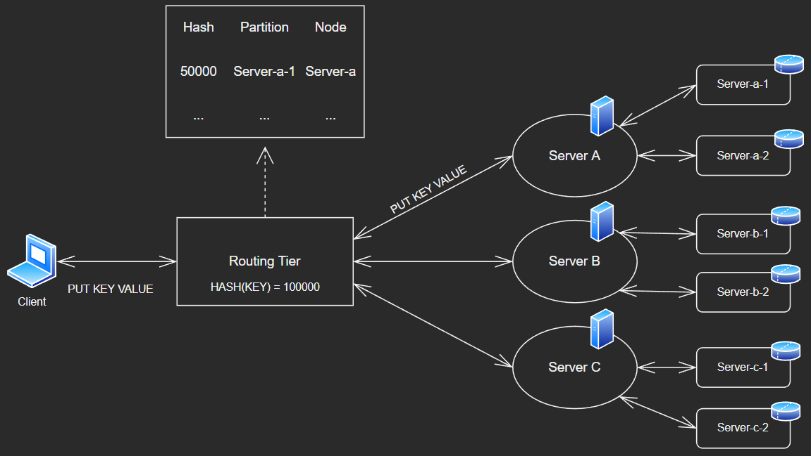
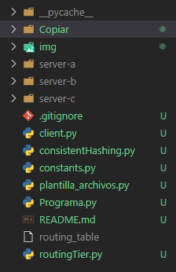
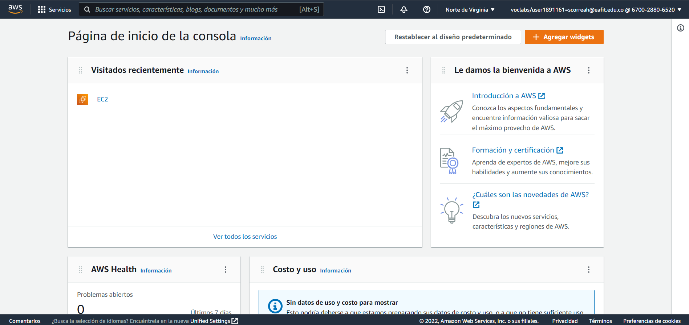
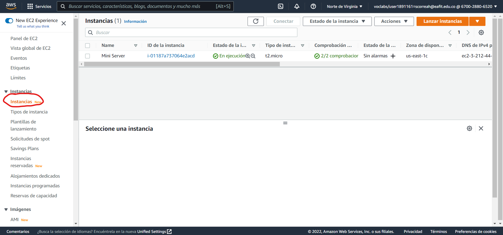
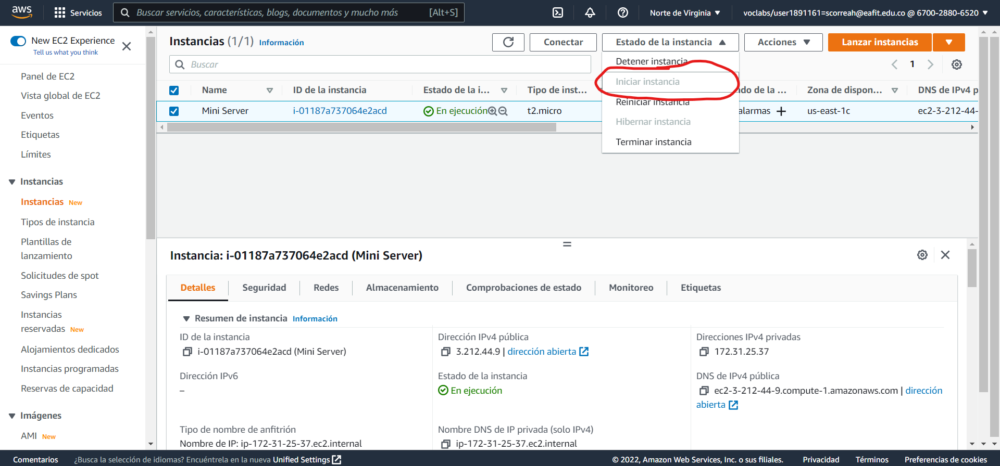
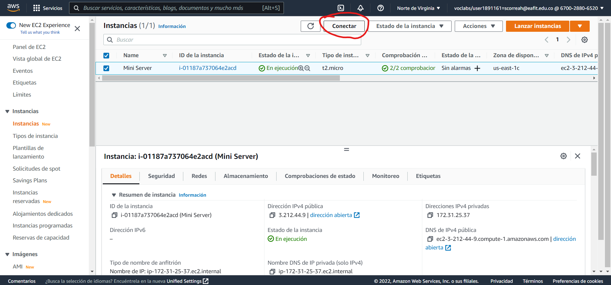
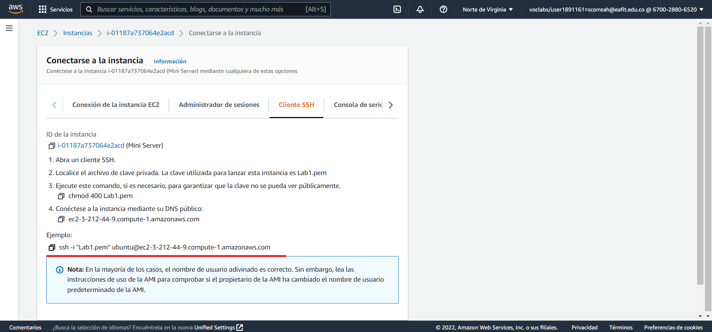

# **Project 01 ()- Key Value Distributed DB**Complete

### **Información general**
> Info de la materia: ST0263 Tópicos especiales en telemática

> Estudiante(s): 
> * Simón Correa Henao, scorreah@eafit.edu.co
> * Santiago Ochoa Castaño, sochoac1@eafit.edu.co
> * Miguel Ángel Zapata Jimenez, mazapataj@eafit.edu.co 
> * Samuel Meneses Diaz, smenesesd@eafit.edu.co 

> Profesor: Edwin Nelson Montoya, emontoya@eafit.edu.co 

---  

## **1. Breve descripción de la actividad**

Se realizó el desarrollo e implementación de una base de datos distribuida con un sistema de archivos key-value. Ademas de esto, realiza operaciones basicas tipo CRUD, y la comunicación es establecida por medio de sockets. La base datos cuenta con particionamiento, gestionado mediante una routing tear. Y además, cuenta con replicación, realizado por medio de un mecanismo de leader-follower.

### **1.1. Que aspectos cumplió o desarrolló de la actividad propuesta por el profesor (requerimientos funcionales y no funcionales)**
* La visión global del sistema es un cliente externo interesado en Almacenar datos <k,v> en una base de datos distribuida
* El cliente de la base de datos enviará las peticiones CRUD a través de una API Sockets.
* Las operaciones put y get garantizan la consistencia de los datos.
* La recuperación de los datos se realizará por (k).
* El servidor es concurrente, es decir, permite conectarse a varios clientes al tiempo.
* El servidor decodifica las peticiones. Si hay una opción que no es decodificada por el programa, deberá sacar el mensaje de error correspondiente y entregar la respuesta.
* El Servidor es capaz de escuchar peticiones a nivel de sockets TCP en cualquier puerto. 
* Se define protocolo de comunicación entre el cliente y el servidor, a través de queries y ejecutados en una CLI.
* El servidor está desplegado en una máquina virtual en AWS Academy, con IP Elástica, oyendo por el puerto 5000.  
* La base de datos implementa algoritmos basicos de particionamiento.
* La base de datos implementa el particionamiento mediante un mecanismo de claves y el hash SHA1
* El cliente está en capacidad de contactar el Frontend de la base de datos  (ServerFrontend) el cual recibe el requerimiento CRUD del cliente, y determina que servidor de datos (ServerData) procesa dicho requerimiento

### **1.2. Que aspectos NO cumplió o desarrolló de la actividad propuesta por el profesor (requerimientos funcionales y no funcionales)**
* La base de datos implementa algoritmos basicos de replicación y particionamiento.
* La base de datos presenta flexibilidad al momento de realizar escalamiento. Adicionalmente, tiene mecanismos de tolerancia a fallos.
* La base de datos implementa la replicacion utilizando el esquema más básico leader-follower con Consistencia Eventual (sync+async)
* El sistema permite almacenar n registros con la misma clave <k>
* El sistema garantiza la consistencia de datos haciendo....
* Los servidores de datos (ServerData), cooperan, coordinan y ejecutan las acciones del CRUD para garantizar Rendimiento, Confiablidad, Tolerancia a Fallos, Seguridad y Escalabilidad entre otros.
* La base de datos posee operaciones para garantizar la transaccionalidad de las operaciones y consultas
* El sistema de la base de datos es de tipo WORM
  
---

## **2. Información general de diseño de alto nivel, arquitectura, patrones, mejores prácticas utilizadas**
* Se implenta el patrón P2P Hybrid Server Based.
* Se siguió el principio SRP de Solid (Single Responsability Principle)
* Se siguió el patron de Alta Cohesión e Indirección de Grasp
Se implementan buenas practicas como DRY, YAGNI y el principio de Least Surprise.

   
  

---

## **3. Descripción del ambiente de desarrollo y técnico: lenguaje de programación, librerias, paquetes, etc, con sus numeros de versiones**
* Lenguaje de programación: Python 3.10.1
* Librerías: socket, os, json, threading, hashlib, itertools, sys
### **Como se compila y ejecuta**
Para ejecutar el programa simplemente dirigirse a la carpeta `Project\ 1\ -\ Complete/Entrega\ 2` y ejecutar el comando:
* En Windows:

    ```bash
    py .\consistenHashing.py # Ejecutarse antes que cualquiera de los otros programas. Ahí se específica la cantidad de nodos y particiones que se desea tener y al tiempo se crean.
    py .\server.py # Correr en cada carpeta recien creada el server.py para habilitar los servidores.
    py .\routingTier.py # Ejecutarse despues de haber ejecutado los server.py en cada una de las carpeta server creadas
    py .\client.py # Ejecutarse despues de que el servidor routingTier.py se encuentre activo 
    ``` 
* En Linux:
     ```bash
     sudo python3 ./consistenHashing.py
     sudo python3 ./server.py
     sudo python3 ./routingTier.py
     sudo python3 ./client.py
     ```
### **Detalles del desarrollo**
El proyecto se desarrolló en python por medio de 8 archivos: 
* server.py: Contiene el programa principal del nodo, el manejo de threads y la inicialización de los sockets. También, recibe requests del cliente que representan comandos para manejar la base de datos fortDB e igualmente envía responses al cliente según el comando envíado.
* constants.py: Contiene constantes y variables usadas a través de varios de los otros archivos del proyecto.
* fortDB.py: Implementa los queries tipo CRUD que permiten el manejo de la base de datos. 
* client.py: Se encarga de decodificar o explicar los diferentes mensajes recibidos y entregados en los request y response por el mini servidor. Los usuarios lo pueden usar a modo de **interfaz de línea de comandos** (CLI) para ejecutar queries CRUD sobre la base de datos.
* consistenHashing.py: ConsistentHashing de acuerdo a la cantidad de nodos y particiones que el usuario desea crear, configura el espacio de particionamiento a través de una tecnica conocida como hash consistente. La idea es simple, a cada partición de un nodo se le asigna un nombre y este nombre se codifica con la misma función utilizada para codificar las claves almacenadas en el sistema. Esto producirá un valor determinista en el espacio hash, y ese valor será el valor mínimo servido por esa partición. Gracias a la difusión, los nombres de todas las particiones generarán diferentes valores hash que no coincidirán fácilmente, y este es la forma en que generamos la tabla de enrutamiento.
* Programa.py: Se encarga de la creación de los nodos y sus respectivas particiones. Cada nodo se representa como una carpeta y consta de los siguientes archivos: server.py, constants.py, fortDB.py y unos archivos de texto que dependen de la cantidad de particiones que se hayan indicado. 
* plantilla_archivos.py: Se encarga crear las carpetas respectivas y de copiar los archivos requeridos por cada nodo y partición especificada previamente por el usuario, al momento de iniciar por primera vez la base de datos.
* routingTier.py:  Es la capa intermedia que hace de middleware para redireccionar todas las consultas del cliente al nodo correspondiente con la partición en que se encuentra almacenada la llave utilizada. Es decir, esta capa identifica donde se encuentra la llave con la que se está realizando la consulta del usuario, y redirige la consulta a esa partición correspondiente. Para finalmente recibir la respuesta y entregarsela al cliente. Routing Tier, además tiene conocimiento y hace uso de una tabla de enrutamiento para identificar a donde enviar cada query.

### **Detalles técnicos**
El lenguaje de programación fue python, se importaron las librerías mediante la semantica `import nombre_libreria` y se implementó el mini servidor online mediante el servicio EC2 de AWS en una maquina Ubuntu.

### **Descripción y como se configura los parámetros del proyecto (ej: ip, puertos, conexión a bases de datos, variables de ambiente, parámetros, etc)**
El proyecto se encuentra configurado con las configuraciones locales, pero para ponerlo a correr en una maquina se puede modificar el valor de `IP_SERVER` en el archivo `constants.py` para refererirse a la dirección IP privada de la maquina. Asegurandose que el firewall(Reglas de seguridad de la máquina EC2) permita el flujo de peticiones por el puerto 5000, u otro puerto especificado en la constante `PORT`.

### **Detalles de la organización del código por carpetas o descripción de algún archivo**
 
  
  
---

## **4. Descripción del ambiente de EJECUCIÓN (en producción) lenguaje de programación, librerias, paquetes, etc, con sus numeros de versiones**.

* Lenguaje de programación: Python 3.10.1
* Librerías: socket, os, json, threading, hashlib, itertools, sys  
* Servidor alojado en una instancia de EC2 de AWS

### **IP o nombres de dominio en nube o en la máquina servidor**
> Dirección de la maquina: [http://3.212.44.9/](http://3.212.44.9/)

### **Descripción y como se configura los parámetros del proyecto (ej: ip, puertos, conexión a bases de datos, variables de ambiente, parámetros, etc)**
[Explicado en la sesión de Detalles Tecnicos](#detalles-técnicos).

Además para configurar la maquina externa por ejemplo en AWS, en el archivo `constants.py` se expecifica la dirección IP privada de la maquina, para luego acceder a ella mediante el cliente a través de la CLI  

### **Como se lanza el servidor**
Para lanzar el servidor de AWS, se siguen los siguientes pasos:
1. Se accede a AWS Academy a `EC2`:

2. Se selecciona en el submenú la sesión de `Instancias`:

3. Selecciona la instancia del mini servidor, y click en `Estado de la Instancia` -> `Iniciar Instancia`:

4. Con la instancia en ejecución, click en `Conectar`, y copiar el comando del final:


5. Descargar el `.pem` de la maquina y en la carpeta contenedora del archivo, ejecutar el comando copiado en el paso anterior.

6. Dirigirse a la carpeta y ejecutar el comando `sudo python3 consistentHashing.py` o `python3 consistentHashing.py`:  
7. Dirigirse a la carpeta de cada servidor creado y ejecutar el comando `sudo python3 server.py` o `python3 server.py`  
8. Dirigirse a la carpeta donde esta el archivo routingTier.py y ejecutar el comando `sudo python3 routingTier.py` o `python3 routingTier.py`  
9. Desde el cliente, dirigirse a la carpeta contenedora y ejecutar el comando `sudo python3 client.py` o `python3 client.py`:

### **Una mini guia de como un usuario utilizaría el software o la aplicación**
**FortDB** es una base datos key-value con almacenamiento en disco de la información. A continuación se explican los comandos `PUT`, `GET`, `DELETE`, `PING`, `EXIT`.  

**PUT**  
Con este comando el usuario puede crear un registro key-value. Igualmente, si la key del registro ya existe, se genera un update del valor.
```bash
    PUT key value
```  
  
**GET**  
Con este comando el usuario puede recuperar el valor correspondiente a una key.  
```bash  
    GET key
```  

**DELETE**
Con este comando el usuario puede eliminar un registro ennvíando su clave.
```bash
    DELETE key
``` 

**PING**  
Con este comando se verfica conexión con la base de datos. 
```bash
    PING
```  

**EXIT**  
Con este comando el usuario termina la conexión con el servidor y sale de la API.  
```bash
    EXIT
```

---

## **5. Otra información que considere relevante para esta actividad**

### **Referencias:**

* [Proyecto de Telematica](https://github.com/scorreah/Telematica-Client-Server)

* [Quora Ideas](https://www.quora.com/How-can-I-create-my-own-database-in-python)

* [Lectura Amazon Dynamo](https://interactivavirtual.eafit.edu.co/d2l/le/content/103481/viewContent/488679/View)

* [Lectura Partitioning](https://interactivavirtual.eafit.edu.co/d2l/le/content/103481/viewContent/488681/View)

* [Lectura Replication](https://interactivavirtual.eafit.edu.co/d2l/le/content/103481/viewContent/488682/View)

* [The Digital Cat Ideas](https://www.thedigitalcatonline.com/blog/2022/08/23/data-partitioning-and-consistent-hashing/)


#### versión README.md -> 2.0 (2022-septiembre)