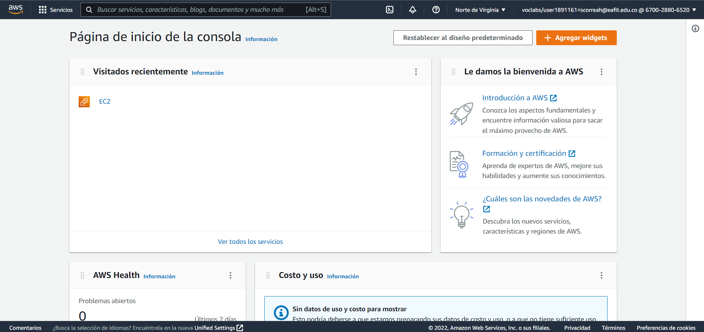

# **Project 01 - REDIS**

### **Información general**
> Info de la materia: ST0263 Tópicos especiales en telemática

> Estudiante(s): 
> * Simón Correa Henao, scorreah@eafit.edu.co
> * Santiago Ochoa Castaño, sochoac1@eafit.edu.co
> * Miguel Ángel Zapata Jimenez, mazapataj@eafit.edu.co

> Profesor: Edwin Nelson Montoya, emontoya@eafit.edu.co

---  

## **1. Breve descripción de la actividad**

Instalación y uso de la base de datos key-value *Redis* en modo single-node y clúster. Acompañado del aprendizaje de operaciones CRUD con Redis, desde la linea de comandos *redis-cli*, y por medio de python. Finalmente, añadiendo implementación de Redis como MOM y estudiando su analisis.


### **1.1. Que aspectos cumplió o desarrolló de la actividad propuesta por el profesor (requerimientos funcionales y no funcionales)**
* Activación de la infraestructura TI para el desarrollo de la actividad.
* Uso de la base de datos redis mediante operaciones ejemplo CRUD en la versión single-node.
* Utilizando el lenguaje de programación python, creacion de diferentes programas .py que implementan diferentes operaciones CRUD sobre la base de datos redis.
* Instalación y configuración de la base de datos redis en modo clúster (multiple-nodes) teniendo en cuenta configuraciones de replicación, particionamiento, acceso distribuido, entre otros.
* Realización de una simulación o aplicación que aprovecha las características de REDIS como MOM.
* Redis permite la distribución de la carga en el modo cluster.
* El modelo de mensajería implementado es publish & suscribe y permite la comunicación uno a muchos, por medio de topicos/canales. 
* Los servidores de redis estan desplegados en una máquina virtual en AWS Academy, con IP Elástica en los puertos 6379 para la versión single node, y 7000-7009 para el modo cluster.  
  
---  

## **2. Información general de diseño de alto nivel, arquitectura, patrones, mejores prácticas utilizadas**

- Se implementa la versión single-node para la representación de operaciones CRUD. Se representa en el diagrama a continuación.  

- La base de datos redis en modo cluster (multiple-nodes) teniendo en cuenta configuraciones de **replicación**, **particionamiento** y **acceso distribuído**. Se representa en el diagrama a continuación:  
  
  
**Publish/Subscribe**
- Se siguió el principio SRP de Solid (Single Responsability Principle)
- Se siguió el patron de Alta Cohesión e Indirección de Grasp  

  
---

## **3. Descripción del ambiente de desarrollo y técnico: lenguaje de programación, librerias, paquetes, etc, con sus numeros de versiones**

### **3.1. Activación de la infraestructura TI para el desarrollo de la actividad:** 
1. En una maquina de EC2 de AWS se activa trafico por el puerto TCP 6379.

2. Se ingresa a la maquina por medio de SSH y se comienza la instalación de redis server mediante los siguientes comandos:
   
    ```bash  
    sudo apt install lsb-release

    curl -fsSL https://packages.redis.io/gpg | sudo gpg --dearmor -o /usr/share/keyrings/redis-archive-keyring.gpg

    echo "deb [signed-by=/usr/share/keyrings/redis-archive-keyring.gpg] https://packages.redis.io/deb $(lsb_release -cs) main" | sudo tee /etc/apt/sources.list.d/redis.list
            
    sudo apt-get update
    
    sudo apt-get install redis
    ```
3. Se verifica la instalación exitosa de redis  
  

4. El servidor recien creado, se configura con autenticación, es decir, se coloca una password.  


5. También, para garantizar la persistencia en disco y no se pierdan los datos se habilita el modo de almacenamiento a appendonly.  
      
    Modificar el archivo redis.conf para que funcione correctamente la configuración de appendonly.
    

    

6. Se confirma la línea de comandos de redis con algunas funciones básicas.  
    

### **Como se compila y ejecuta** 
1. Iniciar la maquina **redis** como se explica en la sección [Lanzar el servidor](#como-se-lanza-el-servidor). 
2. Dependiendo de la maquina iniciada, acceder a la terminal de redis:
   
    a. Para la versión single-node:
    ```bash
    redis-cli
    ```
    b. Para la versión cluster:
    ```bash
    redis-cli -p 7000 -c
    ```
    > Luego de la opción -p, se especifica el puerto (servidor), al que se quiere conectar. O en otras palabras, cual de los nodos. Están habilitados, del 7000-7004 los masters, y del 7005-7009 los slave (replicas).
3. ddd

### **Detalles del desarrollo**

El proyecto (punto 5) se desarrolló en python por medio de 3 archivos: 
* **pub.py:** Simula uno de los sensores disponible, particularmente el sensor de temperatura. Adicionalmente, se encarga de publicar los datos generados en el canal weather.
* **config.py:** Contiene constantes y variables usadas a través de varios de los otros archivos del proyecto.
* **consumer.py:** Se encarga de extraer los datos del canal y mostrarlos en la terminal. 

### **Detalles técnicos**
* **Motor de base de datos:** Redis  
* **Versiones**: Redis 7.0

### **Detalles de la organización del código por carpetas o descripción de algún archivo.**

  

### **3.2. Uso de la base de datos redis mediante operaciones ejemplo CRUD en la versión single-node, multiple-nodes y utilizando el lenguaje de programación Python:** 

1. Ingresar a las actividades CRUD desde linea de comando redis-cli propuestas en el capitulo 8 del libro Siete Bases de datos en siete semana.

2. Para comenzar se utiliza **SET** para asignar una **key** y su valor correspondiente. Asimismo, se utiliza **GET** para recuperar el valor de la clave recién creada.  
  
**Codigo python:**  
    ```python  
    def get_set_example():
        print("SET yt https://www.youtube.com/")
        print(f"{r.set('yt', 'https://www.youtube.com/')}")
        print("GET yt')")
        print(f"{r.get('yt')}")
    ```

3. Para reducir el tráfico, se establecen múltiples valores con **MSET**. Correlativamente, **MGET** toma múltiples claves y devuelve valores como una lista ordenada.  
  
**Como se ejecuta en cluster:**  
  
**Codigo python:**  
    ```python
    def mget_mset_example():
        print("MSET intvir https://interactivavirtual.eafit.edu.co/ thm https://tryhackme.com/ ")
        print(f"{r.mset({'intvir': 'https://interactivavirtual.eafit.edu.co/','thm': 'https://tryhackme.com/'})}")
        print("MGET intvir thm")
        print(f"{r.mget('intvir', 'thm')}")
    ```  

4. Aunque Redis almacena cadenas, reconoce números enteros y proporciona algunas operaciones simples para ellos. Se puede incrementar con **INCR**, decrementar con **DECR**, y incrementar o decrementar n cantidad de veces con **INCRBY** o **DECRBY** respectivamente.
   
      
**Codigo python:**  
    ```python  
    def incr_example():
        print("INCR count")
        print(f"{r.incr('count')}")
        print("GET count")
        print(f"{r.get('count')}")
    ```

5. Se corren transacciones en la base de datos, iniciando con **MULTI** y ejecutandola con **EXEC**. Los comandos se ponen en cola y luego se ejecutan en secuencia.  
  
**Como se ejecuta en cluster:**  
      
**Codigo python:**  
    ```python  
    def multi_exec():
    print("MULTI")
    p = r.pipeline()    #In redis-py MULTI and EXEC can only be used through a Pipeline object.
    print("SET prag http://pragprog.com")
    print(f"{p.set('prag', 'http://pragprog.com')}")
    print("INCR count")
    print(f"{p.incr('count')}")
    print('EXEC')
    print(f"{p.execute()}")
    ```

6. Tipos de datos complejos.
    - **HASHES**  
    Los hashes son objetos Redis anidados que pueden tomar cualquier número de pares clave-valor. Recuerde que los ":" son convención para los nombres de las keys. Para realizar seguimiento de la clave única de Redis para recuperar todos los valores del HASH usamos **HVALS**. También, podemos recuperar todas las claves del HASH usando **HKEYS**. Existen más comandos específicos de hash para eliminar campos hash ( **HDE** ), incrementar el valor de un campo entero en algún conteo ( **HINCRBY** ), recuperar la cantidad de campos en un hash ( **HLEN** ), obtener todas las claves y valores ( **HGETALL** ), establecer un valor solo si la clave aún no existe ( **HSETNX** ), y más.  
      
    **Como se ejecuta en cluster:**  
      
    **Codigo python:**  
        ```python  
        def hmset_hvals_hkeys_hget():
        print("HMSET user:davita name 'davita' age 30")
        r.hmset("user-davita",{
            "name": "davita", 
            "age": 30
        })
        print("HVALS user:davita")
        val = r.hvals("user-davita")
        print(f'{val}')
        print("HKEYS user:davita")
        val2 = r.hkeys("user-davita")
        print(f'{val2}')
        print("HGET user:davita name")
        val1 = r.hget("user-davita","name")
        print(f'{val1}')
        ```
    - **LISTS**  
    Las listas contienen multiples valores ordenados que pueden actuar tanto como colas o pilas. Para crear una lista crea una key **USERNAME:wishlist** y se hace push mediante **RPUSH**. También, se calcula la longitud de la lista **LLEN**. Seguidamente, podemos recuperar con **LRANGE** cualquier parte de la lista especificando la primera y última posición. Todas las operaciones de lista en Redis usan un índice de base cero. Una posición negativa significa el número de pasos desde el final. Para eliminar una clave se utiliza **LREM** seguido del número de coincidencias a eliminar. Para eliminar y recuperar cada valor en el orden en que los agregamos (como una cola), podemos sacarlos de la izquierda (encabezado) de la lista con **LPOP**. Por otro lado, Redis proporciona un solo comando para sacar valores de la cola de una lista y pasarlos al principio de otra. Se llama **RPOPLPUSH**.  
      
    **Como se ejecuta en cluster:**  
       
    **Codigo python:**  
        ```python
        def list_example():
            print("RPUSH apolo:wishlist eafit intvir gog thm")
            print(f'{r.rpush("apolo:wishlist", "eafit", "intvir", "gog", "thm")}')

            print("LRANGE apolo:wishlist 0 -1")
            print(f'{r.lrange("apolo:wishlist", 0, -1)}')
            
            print("LREM apolo:wishlist 0 gog")
            print(f'{r.lrem("apolo:wishlist", 0, "thm")}')
            
            print("LPOP apolo:wishlist")
            print(f'{r.lpop("apolo:wishlist", 1)}')
            
            print("RPOPLPUSH apolo:wishlist apolo:visited")
            print(f'{r.rpoplpush("apolo:wishlist", "apolo:visited")}')
        ```
    

    - **Blocking Lists**
    Permite crear un sistema de mensajería siple en el que varios clientes puedan enviar comen reciba los mensajes de la cola.
          
        **Como se ejecuta en cluster:**  
        
   
    - **Sets**  
    Los sets son colecciones desordenadas sin valores duplicados y son una opción excelente para realizar operaciones complejas entre dos o más valores clave, como uniones o intersecciones. Se crean sets y agregan valores con **SADD**. Podemos recuperar el conjunto completo, sin ningún orden en particular, usando el comando **SMEMBERS**. Además, para encontrar la intersección se usa **SINTER**; para encontrar la diferencia se usa **SDIFF**, para encontrar la unión se usa **SUNION**; para guardar los datos de una unión en un nuevo valor se usa **SUNIONSTORE**.
        
        **Como se ejecuta en cluster:**  
          
    **Codigo python:**    
        
        ```python  
        def setsExample():
            print("SADD news nytimes.com pragprog.com picso.com.co ")
            print(f'{r.sadd("news", "nytimes.com", "pragprog.com", "picso.com.co")}')

            print("SMEMBERS news")
            print(f'{r.smembers("news")}')
                
            print("SADD tech bbc.com pragprog.com epic.com.co ")
            print(f'{r.sadd("tech", "bbc.com", "pragprog.com", "epic.com.co")}')

            print("SMEMBERS news")
            print(f'{r.smembers("tech")}')

            print("SINTER news tech ")
            print(f'{r.sinter("news", "tech")}')

            print("SDIFF news tech ")
            print(f'{r.sdiff("news", "tech")}')

            print("SUNION news tech ")
            print(f'{r.sunion("news", "tech")}')
                
            print("SUNIONSTORE websites news tech ")
            print(f'{r.sunionstore("websites", "news", "tech")}')
        ```
    
    - **Sorted sets**  
    Estan ordenados como listas y son únicos como conjuntos. Tienen pares de valores de campo como hashes, pero sus campos son puntuaciones numéricas que denotan el orden de los valores en lugar de cadenas simples. Se utiliza **ZADD** para crear el sorted set y encaso de incrementar algún valor de una key se utiliza **ZINCRBY**.  
      
    **Como se ejecuta en cluster:**  
      
    **Codigo python:**  
        ```python  
        def sorted_sets():
            print("ZADD visits 500 7wks 9 gog 9999 prag")
            print(f'{r.zadd("visits", {"7wks":500, "gog":9, "prag":9999})}')

            print("ZINCRBY visits 1 prag")
            print(f'{r.zincrby("visits", 1, "prag")}')
        ```
    
    - **Ranges**  
    Regresa por posición, al igual que el comando **LRANGE** del tipo de datos de la lista. Para obtener los scores de cada elemento se debe agregar **WITHSCORES** y en caso de invertir el orden se utiliza **ZREVRANGE**. En caso de utiliza **ZRANGEBYSCORE** para realizar búsquedas dentro de un intervalo.

          
    **Codigo python:**  
        ```python  
        def ranges():
            print("ZRANGE visits 0 1")
            print(f'{r.zrange("visits", 0, 1)}')

            print("ZREVRANGE visits 0 -1 WITHSCORES")
            print(f'{r.zrevrange("visits", 0,-1, withscores=True)}')

            print("ZRANGEBYSCORE visits 9 9999")
            print(f'{r.zrangebyscore("visits", 9, 9999)}')

            print("ZRANGEBYSCORE visits -inf inf")
            print(f'{r.zrangebyscore("visits", float("-inf"), float("inf"))}')
            
            print("ZREVRANGEBYSCORE  visits inf -inf")
            print(f'{r.zrevrangebyscore("visits", float("inf"), float("-inf"))}')
        ```
    - **Union**  
      Al igual que el tipo de datos establecido, podemos crear una clave de destino que contenga la unión o intersección de una o más claves. El **destination** es la clave para almacenar y la **key** es una o más claves para la unión. **numkeys** es simplemente el número de claves que está a punto de unir, mientras que el **weight** es el número opcional por el que multiplicar cada puntuación de la clave relativa (si tiene dos claves, puede tener dos pesos, y así sucesivamente). Finalmente, el **aggregate** es la regla opcional para resolver cada puntaje ponderado y sumar de forma predeterminada, pero también puede elegir el mínimo o el máximo entre muchos puntajes.


        
      **Codigo python:**  
        ```python  
        def union():
            print("ZADD votes 2 7wks 0 gog 9001 prag")
            print(f'{r.zadd("votes", {"7wks":2, "gog":0, "prag":9001})}')
            

            print("ZUNIONSTORE imp 2 visits votes WEIGHTS 1 2 AGGREGATE SUM")
            print(f'{r.zunionstore("imp",["votes","visits"],aggregate="SUM")}')
            
            print("ZRANGEBYSCORE imp -inf inf WITHSCORES")
            print(f'{r.zrangebyscore("imp", float("-inf"), float("inf"), withscores=True)}')
        ```
    
    - **Expiry**  
      Otro caso de uso común para un sistema de clave-valor como Redis es como un caché de acceso rápido para datos que son más costosos de recuperar o calcular. En casi cualquier caché, asegurarse de que las claves caduquen después de un período de tiempo designado es esencial para evitar que el conjunto de claves crezca sin límites. Marcar una clave para el vencimiento requiere el comando **EXPIRE** , una clave existente y un tiempo de vida (en segundos). Aquí configuramos una clave y la configuramos para que caduque en diez segundos. Podemos comprobar si la clave **EXIST** en diez segundos y devuelve un 1 (verdadero). Si esperamos a ejecutar, eventualmente devolverá un 0 falso).

        
      **Como se ejecuta en cluster:**  
       
      **Codigo python:**  
        ```python  
        def expiry_example():
        
            print("SET ice I m melting...")
            print(f'{r.set("ice", "I m melting...")}')
            
            print("EXPIRE ice 10")
            print(f'{r.expire("ice", 10)}')
            
            print("EXISTS ice")
            print(f'{r.exists("ice")}')

            sleep(10)
            
            print("EXISTS ice")
            print(f'{r.exists("ice")}')
            
            print("SETEX ice 10 I m melting...")
            print(f'{r.setex("ice", 10, "I m melting...")}')

            sleep(3)
            print("TTL ice")
            print(f'{r.ttl("ice")}')
            
            print("PERSIST ice")
            print(f'{r.persist("ice")}')
        ```

### **Detalles técnicos**  
* **Motor de base de datos:** Redis  
* **Lenguaje de programación:** Python  
* **Versiones:** Redis 7.0 y Python 3.10.1  
* **Librerias:** StrictRedis 

* El lenguaje de programación fue python, se importaron las librerías mediante la semantica `import nombre_libreria` y se implementaron los simuladores online mediante el servicio EC2 de AWS en una maquina Ubuntu. Además, se hizo uso de la plataforma Ubidots por medio de una cuenta gratuita en la misma.

### **Como se compila y ejecuta**
1. Iniciar el servidor **redis** como se explica en la sección [Como se compila y ejecuta del numeral 3.1](#como-se-compila-y-ejecuta).  
2. Dirigirse a la carpeta redis_py/ y ejecutar los comandos en el siguiente orden:
* En Linux:

     ```bash
     sudo python3 ./blocking_list.py
     sudo python3 ./expiry.py
     sudo python3 ./get_started.py
     sudo python3 ./hashes.py
     sudo python3 ./union.py
     sudo python3 ./ranges.py
     sudo python3 ./sets.py
     sudo python3 ./sorted_sets.py
     sudo python3 ./multi.py
     sudo python3 ./list.py
     ```
     
### **Instalación del cluster**
1. Se actualizan gestores de paquetes y programas 
  

2. Se realiza la instalación de redis con sus respectivos requerimientos
  

3. Se crea el archivo general de configuración para los nodos del cluster y se organiza en una carpeta por cada nodo
 

4. Se configura el puerto especifico para cada uno de los nodos  
  

5. Se inicia el servidor de cada nodo con su respectivo archivo de configuración  
  

6. Se confirma el estado de lo servidores  
  

7. Se crea el cluster especificando la direccion y el puerto de cada nodo  
  
> Se configuran 10 servidores de los cuales son 5 masters con una replica cada uno  

8. Se aplica la configuración y se chequea el estado de los slots  
  

9. Se realiza la conexión con uno de los nodos y se confirma la infomración especifica de cada nodo  
   

10. Se dispone de la información del todo cluster completo  
  
   
### **3.3 Realice una simulación o aplicación que aproveche las características de REDIS como MOM, y compárelo con las actividades propuestas en el Lab2. Realice ejemplos básicos que demuestre la funcionalidad como Gestor de Colas o Tópicos.**
- **Publish-subscribe**  
    Se permite que el usuario publique un comentario para varios suscriptores. Esto se logra con archivos python **pub.py** y **susc.py**. Ambos archivos, se conectan a redis mediante una interfaz, y la idea general es que el publish envía cada cierto tiempo datos (tipo json) a un tópico llamado weather. A partir de ahí, los subscribers se suscriben al tópico weather y tienen acceso a los datos.
    Para adaptar el laboratorio 2, se tuvo en cuenta el capitulo 8 Redis del libro "Seven Databases In Seven Weeks". El codigo base para el subscriber es el siguiente:
    
    ```bash
    redis 127.0.0.1:6379> SUBSCRIBE comments
    ​Reading messages... (press Ctrl-C to quit)
    ​ 	1) "subscribe"
    ​ 	2) "comments"
    ​ 	3) (integer) 1
    ```
    En este caso, se entiende que **comments** es el canal donde se espera recibir mensajes.
    
    El código base para el publisher es el siguiente:
    
    ```bash
        redis 127.0.0.1:6379> PUBLISH comments "Check out this shortcoded site! 7wks"
        (integer) 2  
    ```  

    Ambos suscriptores recibirán una respuesta multibulto (una lista) de tres elementos: la cadena "mensaje", el nombre del canal y el valor del mensaje publicado.  

    ```bash  
    1) "mensaje"  
    2) "comentarios"  
    3) "¡Mira este sitio de código abreviado! 7 semanas"  
    ```
    
    Los archivos se encuentran en la maquina Redis en AWS y se deben correr de la siguiente forma (Usar dos terminales):  
    ```bash
        python3 pub.py
        python3 susc.py
    ```  
    En relación al laboratorio 2, redis funciona como un middleware. Redis le permite escribir código tradicionalmente complejo con menos líneas y más simples. Con Redis, escribe menos líneas de código para almacenar, acceder y usar datos en sus aplicaciones.
    A continuación se muestra la ejecución de los dos programas:
      
      
    ### **Detalles técnicos**    
    * **Lenguaje de programación:** Python 3.10.1  
    * **Librerias usadas:** time, random, json, StricRedis
---

### **Como se lanza el servidor.**
Para lanzar el servidor de AWS, se siguen los siguientes pasos:
1. Se accede a AWS Academy a `EC2`:

1. Se selecciona en el submenú la sesión de `Instancias`:

3. Selecciona la instancia del mini servidor, y click en `Estado de la Instancia` -> `Iniciar Instancia`:

4. Con la instancia en ejecución, click en `Conectar`, y copiar el comando del final:


5. Descargar el `.pem` de la maquina y en la carpeta contenedora del archivo, ejecutar el comando copiado en el paso anterior.

  
---

## **5. Otra información que considere relevante para esta actividad**

### **Referencias:**
- https://hackernoon.com/resolving-the-crossslot-keys-error-with-redis-cluster-mode-enabled
- https://redis.com/blog/redis-clustering-best-practices-with-keys/
- https://redis.io/docs/
- https://pypi.org/project/redis/
- https://www.digitalocean.com/community/cheatsheets/how-to-change-redis-configuration
- https://learning-oreilly-com.ezproxy.eafit.edu.co/library/view/seven-databases-in/9781680505962/f_0055.xhtml

#### versión README.md -> 2.0 (2022-agosto)