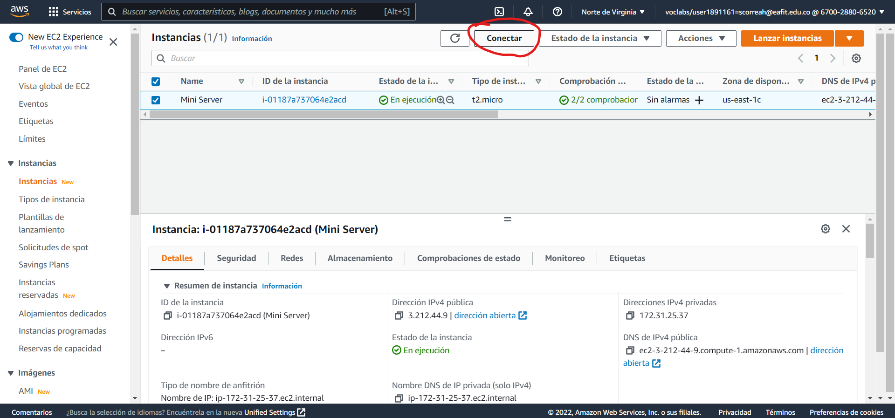

# **Project 01 - REDIS**

### **Información general**
> Info de la materia: ST0263 Tópicos especiales en telemática

> Estudiante(s): 
> * Simón Correa Henao, scorreah@eafit.edu.co
> * Santiago Ochoa Castaño, sochoac1@eafit.edu.co
> * Miguel Ángel Zapata Jimenez, mazapataj@eafit.edu.co

> Profesor: Edwin Nelson Montoya, emontoya@eafit.edu.co

---  

## **1. Breve descripción de la actividad**

Instalación y uso de la base de datos key-value *Redis* en modo single-node y clúster. Acompañado del aprendizaje de operaciones CRUD con Redis, desde la linea de comandos *redis-cli*, y por medio de python. Finalmente, añadiendo implementación de Redis como MOM y estudiando su analisis.


### **1.1. Que aspectos cumplió o desarrolló de la actividad propuesta por el profesor (requerimientos funcionales y no funcionales)**
* El middleware orientado a mensajes (MOM) utilizado es RabbitMQ. 
* El MOM permite la comunicación entre un simulador de eventos IoT y un receptor encargado de la visualización de estos. 
* El MOM permite la conexión de multiples clientes simultaneamente.
* El modelo de mensajería implementado permite la comunicación punto a punto, por medio de queues.
* El servidor RabbitMQ está desplegado en una máquina virtual en AWS Academy, con IP Elástica en los puertos 15672 y 5672.  
  
---  

## **2. Información general de diseño de alto nivel, arquitectura, patrones, mejores prácticas utilizadas**

- Se implementa una arquitectura Peer-to-Peer Hibrido Server Based, con un modelo de comunicación punto a punto de Queues.  
- El protocolo utilizado para el intercambio de mensajes con el Broker del MOM es AMQP (Advanced Message Queuing Protocol).
- Se siguió el principio SRP de Solid (Single Responsability Principle)
- Se siguió el patron de Alta Cohesión e Indirección de Grasp
  

    **Diseño de alto nivel:**  
      
  
---

## **3. Descripción del ambiente de desarrollo y técnico: lenguaje de programación, librerias, paquetes, etc, con sus numeros de versiones**
  
### **Detalles técnicos**  

* **Lenguaje de programación:** Python 3.10.1
* **Librerías:** pika, json, time, random y request.  
* **Versiones**: pika 1.3.0, requests 2.28.1

### **Como se compila y ejecuta**
1. Iniciar el servidor RabbitMQ como se explica en la sección [Lanzar el servidor](#detalles-técnicos).  
2. Dirigirse a la carpeta Lab 2/ y ejecutar los comandos en el siguiente orden:
* En Windows:  
    ```bash
    py .\consumer.py
    py .\dht11.py
    py .\gps.py
    ```
    
* En Linux:

     ```bash
     sudo python3 ./consumer.py
     sudo python3 ./dht11.py
     sudo python3 ./gps.py
     ```
### **Detalles del desarrollo**
El proyecto se desarrolló en python por medio de 5 archivos: 
* **gps.py:** Simula uno de los sensores disponibles, particularmen el sensor de ubicación. Adicionalmente, se encarga de enviarle los datos generados al MOM.
* **dht11.py:** Simula uno de los sensores disponible, particularmente el sensor de temperatura. Adicionalmente, se encarga de enviarle los datos generados al MOM.
* **config.py:** Contiene constantes y variables usadas a través de varios de los otros archivos del proyecto.
* **consumer.py:** Se encarga de extraer los datos del MOM y enviarselos a una platafroma IoT para su visualización (Ubidots).
* **ubidots_request.py:** Solamente, a partir de los datos recibidos por parametro, se encarga del envio de datos a la plataforma de IoT Ubidots.  

### **Detalles técnicos**
El lenguaje de programación fue python, se importaron las librerías mediante la semantica `import nombre_libreria` y se implementaron los simuladores online mediante el servicio EC2 de AWS en una maquina Ubuntu. Además, se hizo uso de la plataforma Ubidots por medio de una cuenta gratuita en la misma.

### **Descripción y como se configura los parámetros del proyecto (ej: ip, puertos, conexión a bases de datos, variables de ambiente, parámetros, etc)**  
> Todas las configuraciones se encuentran en las constantes del archivo config.py.  

El proyecto se encuentra configurado con las configuraciones predeterminadas. En caso de que se quiera conectar con un servidor MOM diferente se debe modificar el valor `MOM_IP` en el archivo `config.py`. Asegurandose que el firewall permita el flujo de peticiones por el puerto 80, 443, 15672, 5672, u otro puerto especificado. 

### **Detalles de la organización del código por carpetas o descripción de algún archivo.**

  
  
---

## **4. Descripción del ambiente de EJECUCIÓN (en producción) lenguaje de programación, librerias, paquetes, etc, con sus numeros de versiones**
* **Lenguaje de programación:** Python 3.10.1
* **Librerías:** pika, json, time, random y request.  
* **Versiones:** pika 1.3.0, requests 2.28.1
* **Servidor:** Alojado en una instancia de EC2 de AWS

### **IP o nombres de dominio en nube o en la máquina servidor**
> **Dirección de la plataforma Ubidtos:** https://industrial.ubidots.com/accounts/signin/  

> **Como ingresar a la plataforma:** El usuario y contraseña se le sera enviado al profesor por correo

### **Descripción y como se configura los parámetros del proyecto (ej: ip, puertos, conexión a bases de datos, variables de ambiente, parámetros, etc)**

Además para configurar la maquina externa por ejemplo en AWS, en el archivo `constants.py` se expecifica la dirección IP privada de la maquina, para luego acceder a ella mediante la dirección publica en el browser.

### **Como se lanza el servidor.**
Para lanzar el servidor de AWS, se siguen los siguientes pasos:
1. Se accede a AWS Academy a `EC2`:

2. Se selecciona en el submenú la sesión de `Instancias`:

3. Selecciona la instancia del mini servidor, y click en `Estado de la Instancia` -> `Iniciar Instancia`:

4. Con la instancia en ejecución, click en `Conectar`, y copiar el comando del final:


5. Descargar el `.pem` de la maquina y en la carpeta contenedora del archivo, ejecutar el comando copiado en el paso anterior.

6. Al ingresar a la maquina virtual se debe ejectutar el comando:
   
   ```bash
   docker start a57139d38dd81f5d62c18fed70e7c23068e5abade01434aa35c6be4a8d1c1808
   ```  
    
7. **(Opcional)** En caso de querer acceder a la aplicación RabbitMQ ingresar a [http://54.226.56.46:15672/](http://54.226.56.46:15672/#/) desde el navegador con el usuario y contraseñas por defecto, especificadas en el enunciado del laboratorio. (De igual manera se le seran enviadas al profesor).
8. Realizar los pasos explicados en [Como se Compila y Ejecuta](#como-se-compila-y-ejecuta) para correr los programas de *producer* y *consumer* en la maquina local si se desea (o en cualquier otra).
 
### **Una mini guia de como un usuario utilizaría el software o la aplicación**
1. Ingresar a [https://industrial.ubidots.com/accounts/signin/](https://industrial.ubidots.com/accounts/signin/) desde el navegador con el usuario y contraseñas enviadas al profesor.
  

## Resultados o pantallazos 
  
  
---

## **5. Otra información que considere relevante para esta actividad**

### **Referencias:**
- [Conozcamos sobre RabbitMQ, sus componentes y beneficios](https://www.pragma.com.co/academia/lecciones/conozcamos-sobre-rabbitmq-sus-componentes-y-beneficios)
- [Simulate data in Ubidots using Python](https://help.ubidots.com/en/articles/569964-simulate-data-in-ubidots-using-python)

#### versión README.md -> 2.0 (2022-agosto)