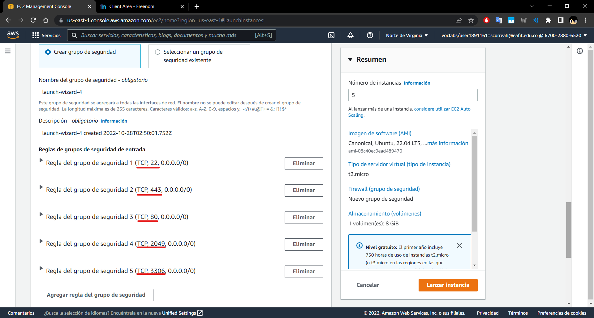
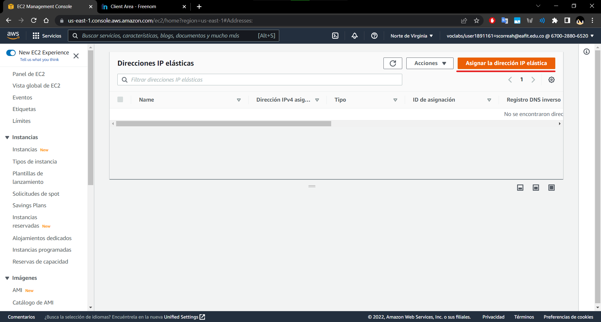

# **Project 02 Complete - Aplicacion LAMP de LMS Escalable**

### **Información general**
> Info de la materia: ST0263 Tópicos especiales en telemática

> Estudiante(s): 
> * Simón Correa Henao, scorreah@eafit.edu.co
> * Santiago Ochoa Castaño, sochoac1@eafit.edu.co
> * Miguel Ángel Zapata Jimenez, mazapataj@eafit.edu.co 
> * Samuel Meneses Diaz, smenesesd@eafit.edu.co 

> Profesor: Edwin Nelson Montoya, emontoya@eafit.edu.co 

---  

## **1. Breve descripción de la actividad**

Se realizó el despliegue de una aplicación open source LAMP de comunidad que representa un sistema de información del tipo Sistema de Gestión de Aprendizaje (LMS). Concretamente de Moodle.
Dicho despliegue se realizó con maquinas de AWS en cloud, utilizando los servicios de AWS EC2, ELB, RDS y EFS.

### **1.1. Que aspectos cumplió o desarrolló de la actividad propuesta por el profesor (requerimientos funcionales y no funcionales)**

* La aplicación monolitica ESCALABLE debe ser desplegada en AWS, con nombre de dominio y certificado SSL válido: [Link de aws](https://cloud.team-ms3.tk/)
* La aplicación debe contar con un load balancer alojado en AWS con el servicio de ELB capaz de redirigir peticiones entre servidores moodle de EC2. 
* El balanceador de carga debe contar con un certificado SSL valido, es decir funcionar con el protocolo https
* El certificado SSL debe ser emitido por la CA Letsencrypt, por medio de la herramienta Certbot.
* Los servidores con Moodle deben estar desplegados en maquinas virtuales en Amazon Web Services (AWS), con IP Elástica, creados a partir de una maquina template EC2
* Los servidores con Moodle deben tener acceso a un servidor de base de datos externo alojado en Amazon RDS.
* La instancia de base de datos debe utilizar el gestor de bases de datos MariaDB
* Los servidores con Moodle deben tener acceso a un servidor NFS alojado en Amazon EFS
* Las maquinas deben instanciar Moodle desde Docker y Docker-Compose
* Las maquinas EC2 deben contar con el servicio de autoscaling
* La dirección IP elastica del balanceador debe contar con un dominio, expedido por el provedor de dominios Freenom
* El servidor DNS debe estar alojado en la nube, particularmente en Cloudflare
* El balanceador, la base de datos, el sistema para NFS y las maquinas para Moodle deben contar cada uno con un grupo de seguridad propio


---

## **2. Información general de diseño de alto nivel, arquitectura, patrones, mejores prácticas utilizadas**
- Se hace uso de una arquitectura Cliente-Servidor 
- El LMS desplegado es Moodle con Contenedores en EC2
- El balanceador se implementa con AWS ELB
- La base de datos hace uso del gestor MariaDB
- La base de datos se implementa con AWS RDS
- Se hace el despliegue en AWS, con t2.micro para EC2
- El sistema NFS utilizado es AWS EFS
- Los servidores contienen Moodle dockerizado con Docker Compose
- Las maquinas virtuales son instancias de Ubuntu 20.04 LTS
- El servidor DNS está alojado en Cloudflare
- El dominio se encuentra en el provedor de dominios Freenom
- El certificado SSL es expedido por Letsencrypt
   

---

## **3. Descripción del ambiente de desarrollo y técnico: lenguaje de programación, librerias, paquetes, etc, con sus numeros de versiones**

* **Docker-compose**: Docker Compose es una herramienta para definir y ejecutar aplicaciones de Docker de varios contenedores. En Compose, se usa un archivo YAML para configurar los servicios de la aplicación. Después, con un solo comando, se crean y se inician todos los servicios de la configuración.

### **3.1 NFS (EFS)**  
1. Se hace la creacion del efs en aws, donde podemos ver el ID del sistema de archivos y dicho nombre que en este caso seria ```efs-moodle ```

2. Se configura la subred con un VPC default con la zona de disponibilidad ```us-east-1a ```, la dicha zona tambien fue utilizada para la configuracion del ELB en AWS

3. A dicho launch del EFS, se le establecieron dos reglas de seguridad, en este caso fueron NFS y MYSQL/AURORA

4. En el sistemas de archivos se configuro que seria un sistemas de archivos EFS con un fs default y con un punto de montaje en ```/mnt/moodle ```

5. Se configuraron los destinos de montaje para cada zona de disponibilidad disponible


### **3.2 MOODLE**
1. Para instalar moodle en las máquinas virtuales se debe instalar y habilitar docker:
    ```
    sudo apt install docker.io -y && sudo apt install docker-compose -y
    mkdir docker && cd "$_"

    sudo systemctl status docker
    sudo systemctl enable docker
    sudo usermod -a -G docker ubuntu
    
    ``` 
2. Luego, creamos el archivo [docker-compose](moodle/docker-compose.yml) y lanzamos el contenedor:
    ```
    sudo nano docker-compose.yaml
    sudo docker-compose up --build -d
    sudo docker ps
    ``` 

### **3.3 Base de datos (RDS)**

1. Lo primero que se realizara despues de haber ingresado al servicio RDS sera crear una base de datos con motor mariaDB  
  
  
2. Luego se escoje la plantilla que se usara, que para este caso es free tier    
  
   
3. Finalmente, creamos la base de datos y podemos verificar que quedo realmente creada como se ve a continuación  
  
  
4. Ya creada la base de datos se procede a conectarla con la instancia de moodle  
  
  
    Se confirma que se asocio de manera correcta   
      
      
5. Se editan las reglas de entrada de la instancia moodle para que pueda conectarse a la base de datos a tráves del puerto 80  
  
  
6. Se puede ver a continuación que la base de datos esta montada de manera correcta  
  
  
7. Se monta un cliente mariaDB en alguna máquina y se corrobora que la conexión sea exitosa  
  
  
8. Para terminar con esta sección se procede a crear una base de datos como se puede obervar en la siguiente imagen  


### **3.4 Load Balancer**  

### **3.4 Crear una AMI para el Servicio de Auto Scaling**

1. Los párametros que se van a colocar son:
  
- Image name: Web Moodle AMI
- Image description: AMI for Web Server
- Click en Create Image. 
2. Así luce la imagen creada


### **3.4 Creando un Target Group**
1. Para la configuració basica
- Tipo de target: Instances
- Grupo de target: TG-MyWebApp
- VPC: VPC-default
- Protocol version: HTTP1


### **3.5 Crear y configurar balanceador de carga**
1. El resumen del load balancer es el siguiente:

2. Para agregar el certificado ssl se configuran los listeners:


### **3.6 Crear y configurar un Launch Template & Grupo de Auto Scaling**
1. Nombre del template:

2. Sistema opeartivo a utilizar:

3. Quitar sub red:

4. Template creado:


### **3.7 Grupo de Autoscaling**
1. Paso 1:   

2. Paso 2:   

3. Paso 3:   

4. Paso 4:   

5. Paso 5:   

6. Paso 6:   


## **3.8 Acceder al load balancer mediante el dominio**
``` ELB-MyWebApp-743005223.us-east-1.elb.amazonaws.com ```

## **3.9 Certificados SSL para el dominio y el LB**

> Para pedir correctamente los certificados SSL para https, luego de seguir los pasos en AWS ELB, lanzaremos una maquina EC2 para pedir los certificados

1. Lo primero que se realizara sera la actualización de la máquina `sudo apt update && sudo apt upgrade -y`  
  
  
2. Luego, se realizar la instalación de certbot `sudo snap install certbot --classic`  
  
  
3. Terminada la instalación, se realiza la instalación de letsencrypt `sudo apt install letsencrypt -y`  
  
  
4. Ahora se procede a instalar nginx `sudo apt install nginx -y`  
  
  
5. Ahora se procede a instalar nginx `sudo apt install nginx -y`  
  
  
6. Despues de instalarlo, se realiza la configuración del nginx.conf  
[GitHub: LB](./lb/nginx.conf)  
  
7. Ahora se crea una carpeta para el letsencrypt y a reiniciar el servicio nginx 
    ```bash
    sudo mkdir -p /var/www/letsencrypt
    sudo nginx -t
    sudo service nginx reload
    ```  
      
  
8. Lo que sigue es pedir las credenciales para el dominio especifico `sudo letsencrypt certonly -a webroot --webroot-path=/var/www/letsencrypt -m scorreah@eafit.edu.co --agree-tos -d cloud.team-ms3.tk`  
  
9. A continuación se piden las credenciales para todo el dominio `sudo certbot --server https://acme-v02.api.letsencrypt.org/directory -d *.team-ms3.tk --manual --preferred-challenges dns-01 certonly`. En este punto se debe crear un registro TXT en el dominio y se hace de la siguiente manera.  
  
  
  
> En este punto nos habrá creado 4 archivos que necesitaremos más adelante para configurar el https en el loadbalancer

10.  Finalmente, una vez realizado la [transferencia de dominio a CloudFlare](#como-se-transfiere-la-zona-dns-a-cloudflare), quedará como a continuación:
    
  


---

## **4. Descripción del ambiente de EJECUCIÓN (en producción) lenguaje de programación, librerias, paquetes, etc, con sus numeros de versiones**.

### **Como se lanza el servidor**  
### Como se crea un dominio:
1. Step 1:  
  

2. Step 2:  
  

3. Step 3:  
  

4. Step 4:  
  

5. Step 5:        
  

6. Step 6:  
  

7. Step 7:  
  

8. Step 8:  
  

9. Step 9:  
  

### Para lanzar el servidor de AWS, se siguen los siguientes pasos:
1. Step 1:  
  

2. Step 2:  
  

3. Step 3:  
  

4. Step 4:  
  

5. Step 5:  
   
  
### Para asignar las ip elasticas se relizan los siguentes pasos:
1. Step 1:  
  

2. Step 2:  
  

3. Step 3:   
  

4. Step 4:   
  

5. Step 5:  
   
  
### Crear par de claves:
1. Step 1:  
  
 
### Como se transfiere la zona DNS a Cloudflare: 
1. Step 1:  
    
2. Step 2:  
    
3. Step 3:  
    
4. Step 4:  
    
5. Step 5:  
    
6. Step 6:  
    
7. Step 7:  
    
8. Step 8:
    

---

## **5. Otra información que considere relevante para esta actividad**

### **Referencias:**

* [Avance Proyecto 2](https://github.com/scorreah/Topicos_de_Telematica/tree/main/Projects/Project%202)

* [Docker Hub Bitnami Moodle](https://hub.docker.com/r/bitnami/moodle)

#### versión README.md -> 2.0 (2022-noviembre)