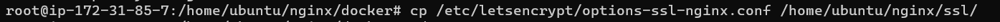

# **Project 02 - Aplicacion LAMP de LMS**

### **Información general**
> Info de la materia: ST0263 Tópicos especiales en telemática

> Estudiante(s): 
> * Simón Correa Henao, scorreah@eafit.edu.co
> * Santiago Ochoa Castaño, sochoac1@eafit.edu.co
> * Miguel Ángel Zapata Jimenez, mazapataj@eafit.edu.co 
> * Samuel Meneses Diaz, smenesesd@eafit.edu.co 

> Profesor: Edwin Nelson Montoya, emontoya@eafit.edu.co 

---  

## **1. Breve descripción de la actividad**

Se realizó el despliegue de una aplicación open source LAMP de comunidad que representa un sistema de información del tipo Sistema de Gestión de Aprendizaje (LMS). Concretamente de Moodle.
Dicho despliegue se realizó en dos ambitos, con maquinas de AWS en cloud, y con el DCA de EAFIT como on-premise.

### **1.1. Que aspectos cumplió o desarrolló de la actividad propuesta por el profesor (requerimientos funcionales y no funcionales)**

* La aplicación monolitica NO-ESCALABLE debe ser desplegada en AWS, con nombre de dominio y certificado SSL válido: [Link de aws](https://cloud.team-ms3.tk/)
* La aplicación  monolítica NO-ESCALABLE debe ser desplegada en DCA, con nombre de dominio y certificado SSL válido: [Link de DCA](https://proyecto23.dis.eafit.edu.co/)
* La aplicación debe contar con un load balancer con nginx capaz de redirigir peticiones entre dos servidores moodle. 
* El balanceador de carga debe contar con un certificado SSL valido, es decir funcionar con el protocolo https
* El certificado SSL debe ser emitido por la CA Letsencrypt, por medio de la herramienta Certbot.
* Los servidores con Moodle deben estar desplegados en maquinas virtuales en Amazon Web Services (AWS), con IP Elástica.
* Los servidores con Moodle deben tener acceso a una instancia de base de datos externa.
* La instancia de base de datos debe utilizar el gestor de bases de datos MariaDB
* Los servidores con Moodle deben tener acceso a una instancia de NFS por el cual se compartirán los archivos del servidor.
* Las maquinas deben instanciar Moodle, Nginx y MariaDB, respectivamente, desde Docker y Docker-Compose
* Todas las instancias deben contar con direcciones IP elasticas
* La dirección IP elastica del balanceador debe contar con un dominio, expedido por el provedor de dominios Freenom
* El servidor DNS debe estar alojado en la nube, particularmente en Route53 de AWS


---

## **2. Información general de diseño de alto nivel, arquitectura, patrones, mejores prácticas utilizadas**
- Se hace uso de una arquitectura Cliente-Servidor 
- El LMS desplegado es Moodle con Contenedores
- El balanceador hace uso de Nginx con Contenedores
- La base de datos hace uso de MariaDB con Contenedores
- Se hace el despliegue en AWS, con t2.micro
- Los servidores contienen Moodle, MariaDB y Nginx dockerizados con Docker Compose, respectivamente.
- Las maquinas virtuales son instancias de Ubuntu 20.04 LTS
- El servidor DNS está alojado dentro de los servicios de AWS, en Route53
- El dominio se encuentra en el provedor de dominios Freenom
- El certificado SSL es expedido por Letsencrypt
- Las maquinas virtuales on-premise se encuentran en [https://proyecto22.dis.eafit.edu.co](https://proyecto22.dis.eafit.edu.co)
   
   
  

---

## **3. Descripción del ambiente de desarrollo y técnico: lenguaje de programación, librerias, paquetes, etc, con sus numeros de versiones**

* **Docker-compose**: Docker Compose es una herramienta para definir y ejecutar aplicaciones de Docker de varios contenedores. En Compose, se usa un archivo YAML para configurar los servicios de la aplicación. Después, con un solo comando, se crean y se inician todos los servicios de la configuración.

### **3.1 NFS**    
* Lo primero que se realizara sera un "update y upgrade" de la máquina virtual `sudo apt update && sudo apt upgrade -y`.  
  
  
* Despues se debe realizar la instalación del nfs server `sudo apt install nfs-kernel-server -y`.  
  

* Terminada la instalación, se prosigue a crear el directorio que sera compartido por los clientes. Ademas, se deben asignar los permisos tanto a la carpeta como a los archivos  
    ```bash
        sudo mkdir -p /mnt/nfs_share
        sudo chown -R nobody:nogroup /mnt/nfs_share/  
        sudo chmod 777 /mnt/nfs_share/
    ```  
      

* Ahora se procede a otorgar los permisos a los clientes para que puedan acceder al servidor `sudo nano /etc/exports`.  
  
  
  
* Se procede a exportar el directorio NFS que sera compartido `sudo exportfs -a`.  
  
  
* Se procede a exportar el directorio NFS que sera compartido y a reiniciar el servidor NFS  
    ```bash  
        sudo exportfs -a
        sudo systemctl restart nfs-kernel-server
    ``` 
      
      
* En esta parte se debe otorgan el acceso del firewall para el cliente  
    ```bash  
        sudo ufw allow from 172.31.0.0/16 to any port nfs
        sudo ufw allow from 0.0.0.0/0 to any port ssh
    ```  
      
      
* Finalmente, se realiza un enable del firewall y con el status verificamos que las reglas del firewall si estan correctas  
    ```bash
        sudo ufw enable
        sudo ufw status
    ```  
    
* Continuamos con la configuración del cliente. Lo primero que hay que hacer es actualizar la máquina.  
  
  
* Luego se debe instalar el NFS client `sudo apt install nfs-common`  
  
  
* En el cliente se crea una carpeta donde se subiran los archivos compartido.
    ```bash
    sudo mkdir -p /mnt/moodle
    sudo nano /etc/fstab
    ```  
      
      
      
* Finalmente, se realiza el siguiente comando `sudo mount -a`  


### **3.2 MOODLE**
* Para instalar moodle en las máquinas virtuales tanto de aws y dca se debe instalar docker:
    ```
    sudo apt install docker.io -y
    sudo apt install docker-compose -y
    sudo apt install git -y

    sudo systemctl enable docker
    sudo systemctl start docker
    sudo usermod -a -G docker ubuntu
    ``` 
* Luego, crear una carpeta e ir a ella:
    ```
    sudo mkdir /home/userdca/moodle1
    cd moodle1
    ``` 
* Dentro de la carpeta añadir el docker-compose que se encuentra en el github [moodle](https://github.com/scorreah/Topicos_de_Telematica/tree/main/Projects/Project%202/moodle):
    ```
        sudo nano docker-compose.yml
    ``` 
* Finalmente correr el docker-compose de la siguiente manera:
    ```
        sudo docker-compose up -d
    ``` 

### **3.3 Base de datos**
* Lo primero que hacemos al momento de entrar a la base de datos es hacer un
    ``` sudo apt update && sudo apt upgrade -y```    
   

* Luego, instalamos ``` sudo apt install docker.io -y && sudo apt install docker-compose -y ```

  

* Despues se crea una directorio docker

  

* Hacemos un ```sudo systemctl status docker ``` para verificar si esta up o down y luego de verificar esto hacemos un ```sudo systemctl enable docker ``` para habilitar docker

* Luego de haber habilitado docker, entramos al ``` docker-compose.yaml``` y lo editamos   
[GitHub: DB](https://github.com/scorreah/Topicos_de_Telematica/blob/main/Projects/Project%202/db/docker-compose.yml)  
  

* Despues de editar el docker-compose, hacemos un ```sudo docker-compose up --build -d ```, se hace para correr el contenedor. 

  

* Y hacemos un ```sudo docker ps ``` para ver el contenedor este corriendo

*  ```sudo docker exec -it docker_mariadb_1 mariadb --user root -p bitnami_moodle ```, confirma la conexion a la BD

   

* Y dentro de maria db esta fue la configuracion hecha  ```show databases; ```   
 ``` SELECT User FROM mysql.user;```  
  ```CREATE USER 'bn_moodle' IDENTIFIED BY 'moodle123'; ```   
  ```GRANT ALL PRIVILEGES ON *.* TO 'bn_moodle'@'%'; ``` 

   
### **3.4 Load Balancer**  
* Lo primero que se realizara sera la actualización de la máquina `sudo apt update && sudo apt upgrade -y`  
  
  
* Luego, se realizar la instalación de certbot `sudo snap install certbot --classic`  
  
  
* Terminada la instalación, se realiza la instalación de letsencrypt `sudo apt install letsencrypt -y`  
  
  
* Ahora se procede a instalar nginx `sudo apt install nginx -y`  
  
  
* Ahora se procede a instalar nginx `sudo apt install nginx -y`  
  
  
* Despues de instalarlo, se realiza la configuración del nginx.conf  
[GitHub: LB](https://github.com/scorreah/Topicos_de_Telematica/blob/main/Projects/Project%202/lb/nginx.conf)  
  
* Ahora se crea una carpeta para el letsencrypt y a reiniciar el servicio nginx 
    ```bash
    sudo mkdir -p /var/www/letsencrypt
    sudo nginx -t
    sudo service nginx reload
    ```  
      
  
* Lo que sigue es pedir las credenciales para el dominio especifico `sudo letsencrypt certonly -a webroot --webroot-path=/var/www/letsencrypt -m scorreah@eafit.edu.co --agree-tos -d cloud.team-ms3.tk`  
  
* A continuación se piden las credenciales para todo el dominio `sudo certbot --server https://acme-v02.api.letsencrypt.org/directory -d *.team-ms3.tk --manual --preferred-challenges dns-01 certonly`. En este punto se debe crear un registro TXT en el dominio y se hace de la siguiente manera.  
  
  
  
* Se procede a crear una carpeta para el ssl `mkdir -p nginx/ssl ; sudo su`  
  
  
* Ahora se deben copiar las credenciales todo el subdominio especifico y para todo el dominio  
  
  
* Se modifica el options-ssl-nginx.conf  `sudo nano /etc/letsencrypt/options-ssl-nginx.conf`  
  
  
* Luego de moficarlo lo copiamos a la dirección correcta `cp /etc/letsencrypt/options-ssl-nginx.conf /home/ubuntu/nginx/ssl/`  
  
  
* Se piden las claves dhparam `openssl dhparam -out ssl-dhparams.pem 512`  
  
  
* Se copia la clave `cp ssl-dhparams.pem /etc/letsencrypt/`  
  
  
* Se configura el nginx domain `DOMAIN='team-ms3.tk' bash -c 'cat /etc/letsencrypt/live/$DOMAIN/fullchain.pem /etc/letsencrypt/live/$DOMAIN/privkey.pem > /etc/letsencrypt/$DOMAIN.pem'`  
  
  
* Terminado todo lo anterior se prosigue con la instalación de docker `sudo apt install docker.io -y && sudo apt install docker-compose -y`  
  
  
* Se ejecuta el siguiente comando antes de continuar `sudo apt autoremove -y`  
  
* Se instala git `sudo apt install git -y`  
  
* Se crea una carpeta llamada mkdir `mkdir -p nginx`  

* Se clona el repositorio de las siguiente manera `git clone https://github.com/st0263eafit/st0263-2022-2.git`  
  
  
* Se copian los archivos docker-compose.yml, nginx.conf y ssl.conf en la carpeta nginx que se creo  
  
* Se realizan los siguientes comandos  
    ```bash
        sudo systemctl enable docker
        sudo systemctl start docker
        sudo usermod -a -G docker ubuntu
    ```  
      
* Se deshabilita el nginx `sudo systemctl disable nginx ; sudo systemctl stop nginx`  


* Se modifica el archivo docker-compose  
[GitHub: LB](https://github.com/scorreah/Topicos_de_Telematica/blob/main/Projects/Project%202/lb/docker-compose.yml)  
  
* Se modifica el archivo nginx.conf 
[GitHub: LB](https://github.com/scorreah/Topicos_de_Telematica/blob/main/Projects/Project%202/lb/nginx.conf)  
  
* Se sube el docker `sudo docker-compose up --build -d`  
  
  
* Se realiza un enable de docker `sudo docker enable`
  
### **3.5 Conexion y cambios realizados para el DCA**

### Conexion al DCA:
* Para empezar con la instalacion del DCA, se debe revisar el documento enviado por el profesor al correo electronico outlook

* Se debe de decargar el ejecutable en el link que aparece en el correo.
* Se instala el archivo ```openvpn-pfsense-2.5.2-I601.exe ```
* Luego, se ejecuta el cliente OpenVPN y con el user dado a cada estudiante con su respectiva clave


### Cambios realizados para el DCA:
### **moodle**
* Se puede ver los el cambio en el ```docker-compose.yaml ``` del DCA en la parte del moodle:
[GitHub: DCA moodle](https://github.com/scorreah/Topicos_de_Telematica/blob/main/Projects/Project%202/moodle/docker-compose-dca.yaml) 
* Se le aplicaron las reglas: 

  ```sudo ufw allow from 192.168.10.0/24 to any port nfs ```

  ```sudo ufw allow from 0.0.0.0/0 to any port ssh ```

  ```sudo ufw allow from 0.0.0.0/0 to any port http ```
  
  ```sudo ufw allow from 0.0.0.0/0 to any port https ```
  
  ```sudo ufw allow from 192.168.10.0/24 to any port 3306 ```
  
  ```sudo ufw enable ```
  
  ```sudo ufw status ```

### **Load balancer**
* Se puede ver los cambios realizados en el ```docker-compose.yaml ``` del DCA en la parte del load balancer:
[GitHub: DCA LB](https://github.com/scorreah/Topicos_de_Telematica/blob/main/Projects/Project%202/lb/docker-compose-dca.yml)

* Se puede ver los cambios realizados en el ```nginx.conf ``` del DCA en la parte del load balancer:
[GitHub: DCA LB](https://github.com/scorreah/Topicos_de_Telematica/blob/main/Projects/Project%202/lb/nginx-dca.conf)
  
---

## **4. Descripción del ambiente de EJECUCIÓN (en producción) lenguaje de programación, librerias, paquetes, etc, con sus numeros de versiones**.

### **Descripción y como se configura los parámetros del proyecto (ej: ip, puertos, conexión a bases de datos, variables de ambiente, parámetros, etc)**
[Explicado en la sesión de Detalles Tecnicos](#detalles-técnicos).

Además para configurar la maquina externa por ejemplo en AWS, en el archivo `constants.py` se expecifica la dirección IP privada de la maquina, para luego acceder a ella mediante el cliente a través de la CLI  

### **Como se lanza el servidor**  
Como se crea un dominio:
1. Step 1:  
  

2. Step 2:  
  

3. Step 3:  
  

4. Step 4:  
  

5. Step 5:        
  

6. Step 6:  
  

7. Step 7:  
  

8. Step 8:  
  

9. Step 9:  
  

Para lanzar el servidor de AWS, se siguen los siguientes pasos:
1. Step 1:  
  

2. Step 2:  
  

3. Step 3:  
  

4. Step 4:  
  

5. Step 5:  
   
  
Para asginar las ip elasticas se relizan los siguentes pasos:
1. Step 1:  
  

2. Step 2:  
  

3. Step 3:   
  

4. Step 4:   
  

5. Step 5:  
   
  
Crear par de claves:
1. Step 1:  
  
 
Como se crea la zona DNS en Route53: 
1. Step 1:  
  

2. Step 2:  
  

3. Step 3:  
  

4. Step 4:  
  

5. Step 5:  
   

---

## **5. Otra información que considere relevante para esta actividad**

### **Referencias:**

* [Proyecto de Telematica](https://github.com/st0263eafit/st0263-2022-2/tree/main/docker-nginx-wordpress-ssl-letsencrypt)

* [Enunciado Proyecto2 ](https://interactivavirtual.eafit.edu.co/d2l/le/content/103481/viewContent/509178/View)

#### versión README.md -> 2.0 (2022-noviembre)