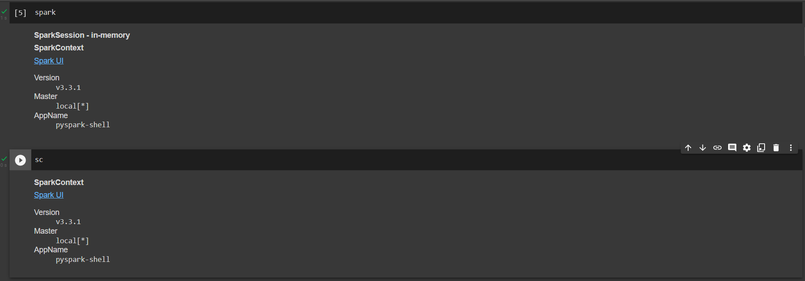
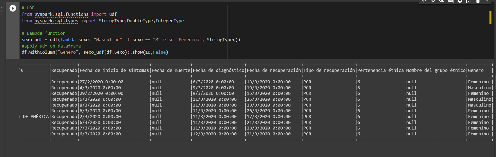
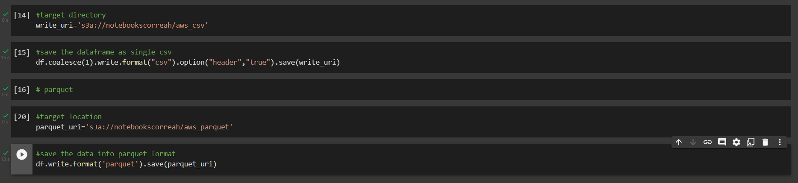

# **Project 3 - Spark con Notebooks y PySpark**

### **Información general**
> Info de la materia: ST0263 Tópicos especiales en telemática

> Estudiante(s): 
> * Simón Correa Henao, scorreah@eafit.edu.co

> Profesor: Edwin Nelson Montoya, emontoya@eafit.edu.co

---  

## **1. Breve descripción de la actividad**

Trabajando con los datos del dataset de Casos Positivos de Covid 19 en Colombia, se hicieron operaciones con los datos por medio de PySpark. Se trabajó con los datos almacenados en AWS S3 y en Google Drive. Se hicieron operaciones sobre los datos y contestaron una serie de preguntas.

### **1.1. Que aspectos cumplió o desarrolló de la actividad propuesta por el profesor (requerimientos funcionales y no funcionales)**

* Las operaciones sobre los datos se realizaron en Google Colab
* Las operaciones sobre los datos se realizaron por medio del dataframe PySpark
* Las operaciones sobre los datos se realizaron por medio de PySpark SQL
* Los datos fueron obtenidos a partir del dataset de Casos Positivos de Covid 19 en Colombia
* Se trabajaron con los datos con origen en AWS S3 y en Google Drive
  
---  

## **2. Descripción del ambiente de desarrollo y técnico: lenguaje de programación, librerias, paquetes, etc, con sus numeros de versiones**
  
### **Detalles técnicos**  

* **Servicios:** Jupyter, Google Colab, Google Drive
* **Dataframe:** PySpark
* **Bucket:** AWS S3

## **Detalles del desarrollo**
## **0) Almacenar datos en AWS S3 y en Google Drive**
### **Descarga de datos con los que trabajar**
   1. Podemos obtener los datos del repositorio o de [datos.gov.co](https://www.datos.gov.co/api/views/gt2j-8ykr/rows.csv?accessType=DOWNLOAD):
        
### **Carga a Google Drive y ejecución desde Google Colab**
   2. Luego nos conectamos a nuestro Google Drive personal y cargamos los archivos:
        
   3. En la carpeta st0263-2266 > bigdata > 03-spark, damos click derecho en el archivo google-colab-setup-pyspark.ipynb, abrir con > Conectar más aplicaciones y elegimos Google Colab:
        
        
   4. Ahora, para confirmar su correcto funcionamiento, ejecutamos todo el archivo:
        
        
        
        
        
### **Carga a S3**
   2. Para cargar los datos a S3:
        
        
        
## **1) Cargar datos desde AWS S3 y desde Google Drive.**
### **Carga desde S3 y conexión a AWS**
El notebook a utilizar es [google_colab_setup_pyspark_aws.ipynb](google_colab_setup_pyspark_aws.ipynb):
   1. Entramos a AWS Learning Lab y damos click en AWS Details, una vez lanzada la sesión:
        
   2. Copiamos estas 3 variables y las pegamos en el notebook (Linea 4):
        
        
        
   3. Probamos a ejecutar el resto del notebook para verificar su correcto funcionamiento:
        
        
        
        
        
### **Carga desde Google Drive**
El notebook a utilizar es [google_colab_setup_pyspark.ipynb](google_colab_setup_pyspark.ipynb):
   1. Copiamos la ruta del archivo con el que vamos a trabajar:
        
   2. Añadimos esta linea en el notebook:
        
   3. Probamos a ejecutar los primeros pasos del notebook para verificar su correcto funcionamiento:
        
        

## **2) Análisis exploratorio del dataframe donde cargamos los datos**
> Este punto se realizó con el archivo [Data_processing_using_PySpark_aws_P3.ipynb](Data_processing_using_PySpark_aws_P3.ipynb) para el caso de AWS
> Este punto se realizó con el archivo [Data_processing_using_PySpark_google_colab_P3.ipynb](Data_processing_using_PySpark_google_colab_P3.ipynb) para el caso de Drive
### **2.1) Columnas**
   1. Mostramos las columnas del archivo y la cantidad de columnas:
        
        
### **2.2) Tipos de datos**
   1. Para mostrar los tipos de datos del csv:
        
### **2.3) Seleccionar algunas columnas**
   1. Para todas las columnas o algunas especificas:
        
### **2.4) Renombrar columnas**
   1. Para seleccionar dos columnas y renombrar una de ellas:
        
### **2.5) Agregar columnas**
   1. Para agregar una columna adicional a partir del calculo con columnas existentes:
        
### **2.6) Borrar columnas**
   1. Para seleccionar varias columnas y borrar una de ellas:
        
### **2.7) Filtrar datos**
   1. Para filtrar los datos por un valor especifico:
        
### **2.8) Ejecutar alguna función UDF o lambda sobre alguna columna creando una nueva.**
   1. Ejemplo de funcion UDF, columna adicional al final:
        
## **3) Preguntas sobre los Datos de Covid**
> Este punto se realizó con el archivo [Data_processing_using_PySpark_aws_P3.ipynb](Data_processing_using_PySpark_aws_P3.ipynb) para el caso de AWS
> Este punto se realizó con el archivo [Data_processing_using_PySpark_google_colab_P3.ipynb](Data_processing_using_PySpark_google_colab_P3.ipynb) para el caso de Drive
### **3.1) Los 10 departamentos con más casos de covid en Colombia ordenados de mayor a menor.**
   1. Con Dataframes:
        
   2. Con Spark SQL:
        
### **3.2) Las 10 ciudades con más casos de covid en Colombia ordenados de mayor a menor.**
   1. Con Dataframes:
        
   2. Con Spark SQL:
        
### **3.3) Los 10 días con más casos de covid en Colombia ordenados de mayor a menor.**
   3. Con Dataframes:
        
   4. Con Spark SQL:
        

### **3.4) Distribución de casos por edades de covid en Colombia.**
   5. Con Dataframes:
        
   6. Con Spark SQL:
        
### **3.5) Distribución de casos por tipo de contagio de covid en Colombia..**
   7. Con Dataframes:
        
   8. Con Spark SQL:
        

## **4) Guardar datos anteriores en AWS S3**
   1. Seguimos los pasos de [Conexion a AWS](#carga-desde-s3-y-conexión-a-aws)
   2. Añadimos estas lineas al final despues de ejecutar el punto 3):
      
## **3. Descripción del ambiente de EJECUCIÓN (en producción) lenguaje de programación, librerias, paquetes, etc, con sus numeros de versiones**
* **Cloud:** Amazon Web Services (AWS)
* **Dataframe:** PySpark
* **Bucket:** AWS S3

## **4. Otra información que considere relevante para esta actividad**

### **Referencias:**
- [Github Topicos_de_Telematica - Lab 6](../../Labs/Lab%206/README.md)
- [Github st0263 Eafit - Bigdata](https://github.com/st0263eafit/st0263-2022-2/tree/main/bigdata/03-spark)

#### versión README.md -> 1.0 (2022-noviembre)